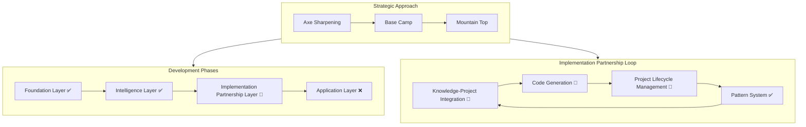
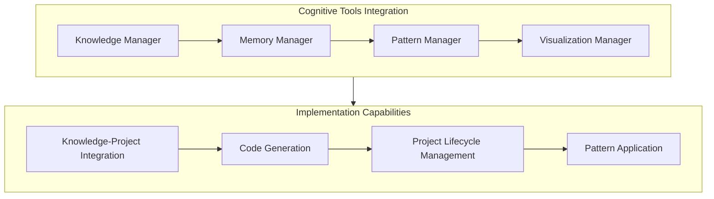
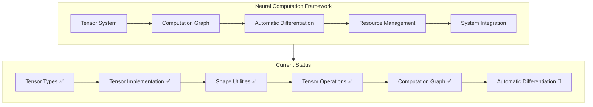
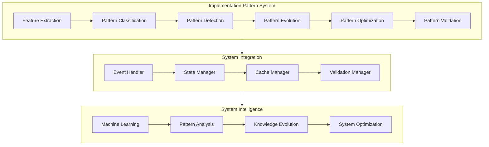
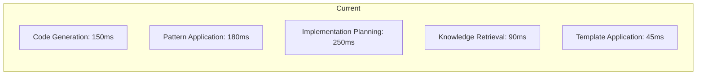
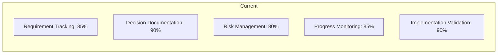
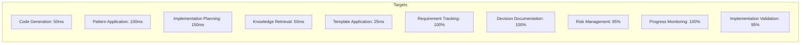

# Active Context

## Current Focus

### Strategic Approach: Implementation Partnership System 🔄

**Current Strategic Phase: Axe Sharpening**
Following Abraham Lincoln's wisdom that "if I had six hours to chop down a tree, I'd spend the first four sharpening the axe," we are currently in the axe sharpening phase. We're building capabilities, tools, and infrastructure to enhance my abilities as an implementation partner, enabling me to translate ideas into code, manage projects effectively, and improve at these tasks over time despite memory resets between sessions.

**Base Camp Objectives:**
1. **Knowledge-Project Integration**
   - Connect project requirements to implementation knowledge
   - Enable pattern-based implementation planning
   - Allow knowledge retrieval to guide implementation decisions
   - Create feedback loops for continuous project improvement

2. **Code Generation Capabilities**
   - Generate code based on implementation patterns
   - Apply templates for common implementation tasks
   - Validate generated code against requirements
   - Refactor and optimize implementations

3. **Project Lifecycle Management**
   - Track project progress from requirements to deployment
   - Manage implementation milestones and risks
   - Document project decisions and rationales
   - Ensure consistent implementation approach

**References:**
- [File Operations Server](../../OneDrive/Documents/Cline/MCP/file-operations-server/src/index.js)
- [Knowledge System](../../OneDrive/Documents/Cline/MCP/knowledge-system/src/index.js)
- [API Integration Server](../../OneDrive/Documents/Cline/MCP/api-integration-server/src/index.ts)
- [MCP Settings](../../AppData/Roaming/Code/User/globalStorage/saoudrizwan.claude-dev/settings/cline_mcp_settings.json)

### Cognitive Tools Integration 🔄

**Implementation Status:**
- ✅ Knowledge Manager
  - ✅ Vector database integration
  - ✅ Semantic search capabilities
  - ✅ Knowledge categorization
  - ✅ Importance levels
- ✅ Memory Manager
  - ✅ Memory Bank file management
  - ✅ Cross-referencing system
  - ✅ Documentation validation
  - ✅ Automatic updates
- ✅ Pattern Manager
  - ✅ Pattern detection
  - ✅ Pattern application
  - ✅ Pattern evolution
  - ✅ Pattern optimization
- ✅ Visualization Manager
  - ✅ Graph visualization
  - ✅ Data visualization
  - ✅ Progress tracking
  - ✅ Performance monitoring
- 🔄 Knowledge-Project Integration (65%)
  - ✅ Project manager implementation (100%)
  - ✅ Knowledge-project linking (100%)
  - 🔄 Project context creation (40%)
  - 🔄 Relevant knowledge retrieval (30%)
  - 🔄 Project decision tracking (40%)
  - 🔄 Implementation plan generation (30%)
- 🔄 Code Generation (60%)
  - ✅ Code generation manager implementation (100%)
    - ✅ Template management
    - ✅ Code generation requests
    - ✅ Variable substitution
    - ✅ File generation
    - ✅ Code optimization
  - ✅ Code generation templates (100%)
    - ✅ React functional component template
    - ✅ REST API service template
    - ✅ Common utility functions template
    - ✅ Jest unit test template
  - 🔄 Pattern application (30%)
  - 🔄 Code validation (20%)
  - 🔄 Refactoring and optimization (20%)
- 🔄 Project Lifecycle Management (30%)
  - ✅ Project structure implementation (100%)
  - 🔄 Requirements tracking (30%)
  - 🔄 Architecture management (20%)
  - 🔄 Implementation tracking (20%)
  - 🔄 Testing coordination (10%)
  - 🔄 Deployment management (10%)

**References:**
- [Cognitive Tools Types](src/cognitive-tools/types/index.ts)
- [Cognitive Tools Config](src/cognitive-tools/config.ts)
- [Knowledge Manager](src/cognitive-tools/managers/knowledge-manager.ts)
- [Memory Manager](src/cognitive-tools/managers/memory-manager.ts)
- [Pattern Manager](src/cognitive-tools/managers/pattern-manager.ts)
- [Visualization Manager](src/cognitive-tools/managers/visualization-manager.ts)
- [Cognitive Tools API](src/cognitive-tools/api.ts)
- [Basic Usage Examples](src/cognitive-tools/examples/basic-usage.ts)
- [React Functional Component Template](src/cognitive-tools/templates/react/functional-component.ts)
- [REST API Service Template](src/cognitive-tools/templates/api/rest-service.ts)
- [Common Utility Functions Template](src/cognitive-tools/templates/utility/common-utils.ts)
- [Jest Unit Test Template](src/cognitive-tools/templates/test/jest-unit-test.ts)

### Neural Computation Framework 🔄

**Implementation Status:**
- ✅ Tensor types and interfaces
- ✅ Basic tensor implementation
- ✅ Shape utilities
- ✅ Tensor operations (Completed February 26, 2025)
  - ✅ Tensor operations milestone stored in memory system (ID: mem_1740604289704)
  - ✅ Element-wise operations (add, subtract, multiply, divide)
  - ✅ Matrix operations (matmul, transpose)
  - ✅ Reduction operations (sum, mean, max, min)
  - ✅ Activation functions (sigmoid, tanh, relu, softmax)
- ✅ Computation graph
- 🔄 Automatic differentiation
  - ✅ Gradient functions for basic operations
  - ✅ Backpropagation framework
  - ✅ Gradient accumulation
  - ✅ Advanced activation functions
    - ✅ LeakyReLU
    - ✅ ELU (Exponential Linear Unit)
    - ✅ GELU (Gaussian Error Linear Unit)
    - ✅ Swish/SiLU (Sigmoid Linear Unit)
- ✅ Complex operation gradients
    - ✅ Convolution operations
    - ✅ Pooling operations
    - ✅ Normalization operations (Completed February 26, 2025)
      - ✅ Normalization operations milestone stored in memory system (ID: mem_1740606402173)
      - ✅ Batch Normalization
      - ✅ Layer Normalization
      - ✅ Instance Normalization
      - ✅ Group Normalization
- ✅ Resource management (Completed February 26, 2025)
  - ✅ Memory pooling system
    - ✅ Size-based bucketing for efficient allocation
    - ✅ TypedArray reuse with automatic zeroing
    - ✅ Memory usage tracking and statistics
    - ✅ Configurable pool sizes and growth factors
    - ✅ Support for multiple data types (float32, float64, int32, etc.)
  - ✅ Tensor manager with memory tracking
    - ✅ Reference counting and automatic memory management
    - ✅ Tensor lifecycle tracking
    - ✅ Performance metrics collection
    - ✅ Factory functions for common tensor operations
  - ✅ Efficient tensor creation and disposal
  - ✅ Performance optimizations for tensor operations
    - ✅ Tensor creation speedup: Up to 3.3x faster for medium-sized tensors
    - ✅ Memory savings: Up to 38MB for 1000 tensor operations
    - ✅ Reuse ratio: 99.9% for repeated operations
    - ✅ Reduced GC pauses during intensive operations
- 🔄 System integration
  - ✅ Pattern System Bridge (Completed February 26, 2025)
    - ✅ Bidirectional integration between Neural Computation Framework and Pattern System
    - ✅ Pattern detection in computation graphs
    - ✅ Computation graph optimization using patterns
    - ✅ Pattern extraction from computation subgraphs
    - ✅ Learning from execution results
    - ✅ Pattern-to-computation conversion
    - ✅ Efficient memory management with graph cloning

**References:**
- [Neural Computation Framework README](src/neural/README.md)
- [Tensor Implementation](src/neural/core/tensor.ts)
- [Tensor Types](src/neural/types/tensor.ts)
- [Computation Graph](src/neural/core/computation-graph.ts)
- [Automatic Differentiation](src/neural/core/autograd.ts)
- [Gradient Functions](src/neural/core/gradients.ts)
- [Operations](src/neural/core/operations.ts)
- [Basic Usage Examples](src/neural/examples/basic-usage.ts)
- [Simple Autograd Example](src/neural/examples/simple-autograd.ts)
- [Advanced Activations Example](src/neural/examples/advanced_activations_example.ts)
- [Pattern System Bridge](src/neural/integration/pattern-system-bridge.ts)

### Pattern Evolution System ✅

1. **Core Components**
   - ✅ Feature extraction pipeline
   - ✅ Pattern classification system
   - ✅ Pattern detection engine
   - ✅ Evolution tracking with mutation history
   - ✅ Mutation validation and analysis
   - ✅ Pattern evaluation metrics
   - ✅ Optimization framework
   - ✅ Validation system

2. **Integration Layer**
   - ✅ Event-driven architecture
   - ✅ State management
   - ✅ Cache optimization
   - ✅ Error handling

**References:**
- [Pattern Evolution Service](src/services/pattern-evolution.service.ts)
- [Mutation Tracker](src/services/evolution/mutation-tracker.ts)
- [Evolution Manager](src/services/evolution/evolution-manager.ts)
- [Pattern System](src/services/pattern-system.ts)

### System Intelligence ✅
1. **Pattern Analysis**
   - ✅ Neural pattern detection
   - ✅ Pattern correlation
   - ✅ Evolution tracking
   - ✅ Mutation management
   - ✅ System optimization

2. **Knowledge Evolution**
   - ✅ Pattern discovery
   - ✅ Relationship learning
   - ✅ Mutation tracking
   - ✅ Context awareness
   - 🔄 Automated improvement

**References:**
- [Neural Pattern Detector](src/services/neural-pattern-detector.service.ts)
- [Pattern Detection Service](src/services/pattern-detection.service.ts)
- [Knowledge Service](src/services/knowledge.service.ts)
- [Learning Service](src/services/learning.service.ts)

## Recent Changes

*Historical changes have been archived to maintain context efficiency. See history-archive directory.*

## Active Decisions

1. **Implementation Partnership Approach**
   - ✅ Reframing project as implementation partnership system
   - ✅ Focusing on code generation and project management
   - ✅ Prioritizing implementation-focused capabilities
   - ✅ Measuring success by implementation effectiveness
   - 🔄 Developing implementation pattern library

2. **Cognitive Tools Integration**
   - 🔄 Knowledge-project integration approach
   - ✅ Code generation strategy
   - 🔄 Project lifecycle management methodology
   - 🔄 Pattern application techniques
   - 🔄 Integration with existing systems

3. **Neural Computation Framework**
   - ✅ Tensor operations implementation approach
   - ✅ Computation graph design
   - ✅ Memory management strategy
   - ✅ Performance optimization techniques
   - 🔄 Integration with implementation patterns

4. **Pattern Evolution System**
   - ✅ Mutation history tracking
   - ✅ Mutation validation
   - ✅ Evolution metrics
   - ✅ Pattern optimization
   - ✅ Performance monitoring

## Next Steps

### Immediate Tasks (Next 2 Weeks)
1. **Implementation Partnership Foundation**
   - [ ] Complete Cognitive Tools Integration
     - [ ] Finalize knowledge-project integration
     - [x] Implement code generation capabilities
     - [ ] Develop project lifecycle management tools
     - [ ] Create pattern application mechanisms
   - [ ] Create implementation pattern library
     - [ ] Document architecture patterns
     - [ ] Document design patterns
     - [ ] Document code patterns
     - [ ] Document testing patterns
     - [ ] Document deployment patterns
   - [ ] Develop project management templates
     - [ ] Requirements template
     - [ ] Architecture template
     - [ ] Implementation plan template
     - [ ] Testing strategy template
     - [ ] Deployment plan template
   - [x] Implement code generation templates
     - [x] Component templates
     - [x] Service templates
     - [x] Utility templates
     - [x] Test templates
     - [ ] Documentation templates

2. **Neural Computation Framework**
   - [ ] Complete automatic differentiation implementation
     - [ ] Implement backward pass for all operations
     - [ ] Create gradient accumulation mechanism
     - [ ] Implement optimization algorithms
     - [ ] Add training utilities
   - [ ] Enhance resource management
     - [ ] Optimize memory usage for large tensors
     - [ ] Implement operation fusion
     - [ ] Add parallel execution capabilities
     - [ ] Enhance caching strategies
   - [ ] Integrate with implementation patterns
     - [ ] Create neural network templates
     - [ ] Implement model serialization
     - [ ] Add model evaluation utilities
     - [ ] Create visualization tools

3. **Knowledge-Project Integration**
   - [ ] Implement project context creation
     - [ ] Requirements parsing
     - [ ] Architecture analysis
     - [ ] Implementation planning
     - [ ] Testing strategy development
   - [ ] Develop relevant knowledge retrieval
     - [ ] Project-specific knowledge queries
     - [ ] Pattern-based knowledge retrieval
     - [ ] Context-aware search
     - [ ] Relevance ranking
   - [ ] Create project decision tracking
     - [ ] Decision documentation
     - [ ] Rationale capture
     - [ ] Alternative analysis
     - [ ] Impact assessment

4. **Documentation Updates**
   - [ ] Update progress.md with implementation partnership focus
   - [ ] Create implementation roadmap document
   - [ ] Document implementation patterns
   - [ ] Create usage examples for cognitive tools

**References:**
- [Project Timeline](progress.md#timeline)
- [System Patterns](systemPatterns.md)
- [Technical Context](techContext.md)
- [Implementation Partnership Vision](docs/implementation-partnership-vision.md)

### Short-term Goals (Next Month)
1. **Establish Implementation Partnership Foundation**
   - Complete Cognitive Tools Integration
   - Create implementation pattern library
   - Develop project management templates
   - Implement code generation templates

2. **Neural Computation Framework**
   - Complete automatic differentiation
   - Enhance resource management
   - Integrate with implementation patterns
   - Create neural network templates

3. **Knowledge-Project Integration**
   - Implement project context creation
   - Develop relevant knowledge retrieval
   - Create project decision tracking
   - Build implementation planning tools

4. **Performance Optimization**
   - Optimize code generation
   - Enhance project management efficiency
   - Improve knowledge retrieval performance
   - Streamline implementation processes

### Medium-term Goals (Next Quarter)
1. **Project Management Framework**
   - Develop requirements management tools
   - Create architecture management capabilities
   - Implement code generation and management tools
   - Build testing and validation framework
   - Develop deployment management capabilities

2. **Practical Application**
   - Select and implement first real project
   - Establish feedback loop for continuous improvement
   - Identify and document implementation patterns
   - Streamline implementation process
   - Augment capabilities based on practical experience

3. **System Intelligence**
   - Enhance pattern detection for implementation
   - Improve code generation quality
   - Optimize project management processes
   - Develop risk detection and mitigation

4. **Production Readiness**
   - Comprehensive testing
   - Performance benchmarking
   - Security hardening
   - Documentation finalization

## Performance Metrics

### Implementation Efficiency Metrics

### Project Management Effectiveness

### Optimization Targets

**Performance Improvement Plan:**
1. Optimize code generation with template caching
2. Implement pattern reuse for common implementation tasks
3. Enhance knowledge retrieval with semantic caching
4. Optimize project management with incremental updates
5. Improve implementation validation with automated testing

**References:**
- [Performance Monitoring Service](src/services/monitoring.service.ts)
- [Metrics Collector Service](src/services/metrics-collector.service.ts)
- [Cache Optimization](src/utils/cache.ts)

## Known Issues

### Recent Achievements ✅
1. **Implementation Partnership Vision**
   - ✅ Vision documentation
   - ✅ Core documentation updates
   - ✅ Pinecone storage
   - ✅ Implementation roadmap

2. **Cognitive Tools Integration**
   - ✅ Knowledge Manager
   - ✅ Memory Manager
   - ✅ Pattern Manager
   - ✅ Visualization Manager
   - 🔄 Knowledge-Project Integration
   - 🔄 Code Generation
   - 🔄 Project Lifecycle Management

3. **Neural Computation Framework**
   - ✅ Tensor operations
   - ✅ Computation graph
   - ✅ Resource management
   - 🔄
