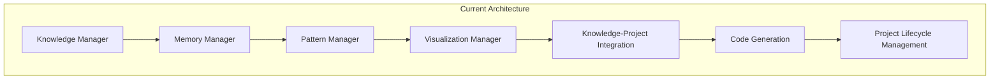
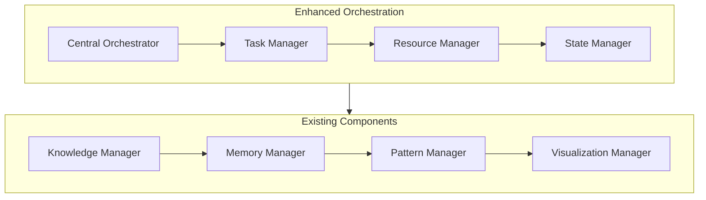
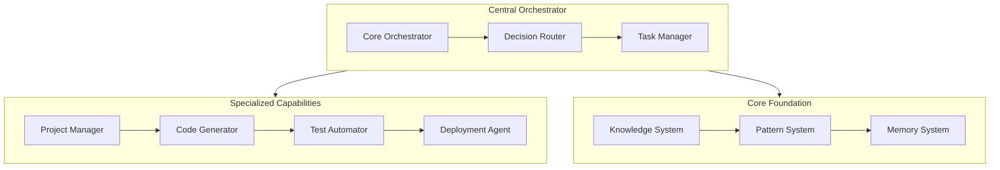
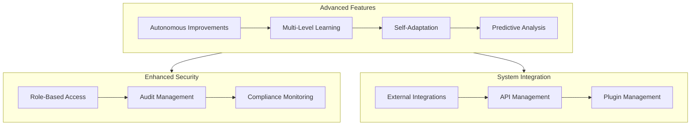

# Future Architecture Vision: Multi-Agent Evolution

## Overview

This document outlines how our current implementation partnership system could evolve toward a multi-agent architecture, building upon our existing foundation while maintaining our core strengths.

## Current Architecture (Phase 3: ~80% Complete)

Our current monolithic-with-modules approach provides:
- ✅ Unified implementation partner with specialized capabilities
- ✅ Clear separation of concerns through managers
- ✅ Strong integration between components
- ✅ Efficient memory and resource management
- ✅ Pattern-based learning and evolution

## Future Evolution Path

### Phase 4: Orchestration Layer (2025 Q3)

1. **Enhanced Orchestration**
   - Task classification and routing
   - Resource allocation
   - State management
   - Cross-component coordination

2. **Integration Points**
   - Knowledge-based task routing
   - Pattern-informed resource allocation
   - Memory-aware state management
   - Visualization-driven monitoring

### Phase 5: Specialized Capabilities (2025 Q4)

1. **Specialized Agents**
   - Project Management Agent
   - Code Generation Agent
   - Testing Agent
   - Deployment Agent

2. **Core Capabilities**
   - Knowledge System
   - Pattern System
   - Memory System
   - Event System

### Phase 6: Advanced Integration (2026 Q1-Q2)

1. **Autonomous Capabilities**
   - Self-improvement mechanisms
   - Adaptive learning systems
   - Predictive optimization

2. **Security Enhancements**
   - Role-based access control
   - Comprehensive audit logging
   - Compliance monitoring

3. **Integration Capabilities**
   - External system connectors
   - API management
   - Plugin system

## Implementation Strategy

### 1. Gradual Evolution
- Complete current Phase 3 implementation
- Introduce orchestration layer as enhancement
- Evolve existing managers into specialized agents
- Maintain backward compatibility

### 2. Key Principles
- Build upon existing strengths
- Maintain implementation partnership focus
- Ensure seamless knowledge integration
- Preserve pattern-based learning

### 3. Migration Path
1. **Stage 1: Orchestration (Q3 2025)**
   - Implement central orchestrator
   - Enhance task routing
   - Add resource management

2. **Stage 2: Specialization (Q4 2025)**
   - Convert managers to agents
   - Implement agent communication
   - Add specialized capabilities

3. **Stage 3: Advanced Features (Q1-Q2 2026)**
   - Add autonomous improvements
   - Enhance security
   - Expand integration capabilities

## Success Metrics

### Implementation Efficiency
- Task routing time: <50ms
- Resource allocation: <100ms
- Cross-agent communication: <25ms
- Pattern application: <150ms

### Quality Metrics
- Code generation accuracy: >95%
- Test coverage: >90%
- Deployment success rate: >99%
- Pattern detection rate: >85%

### Performance Targets
- Response time: <200ms
- Memory efficiency: <500MB
- CPU utilization: <30%
- Network latency: <50ms

## Conclusion

This evolution path allows us to maintain our current momentum while gradually incorporating multi-agent concepts. By building upon our existing foundation rather than replacing it, we ensure continuous improvement while preserving the valuable capabilities we've already implemented.

The focus remains on being an effective implementation partner, with the multi-agent architecture serving to enhance rather than fundamentally change our approach. This ensures we can complete our current phase while laying the groundwork for future improvements.
