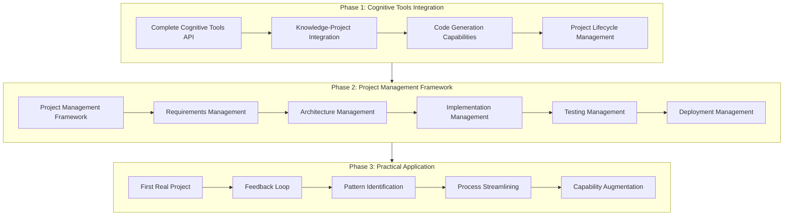

# Implementation Partnership Vision

## Core Purpose

The Memory Bank project's ultimate purpose is to equip Cline to serve as an implementation partner who can:

1. **Translate Ideas into Code**: Transform high-level concepts, goals, and requirements into working implementations
2. **Manage Projects Effectively**: Handle the full project lifecycle from requirements to deployment
3. **Improve Over Time**: Learn from experience and continuously enhance implementation capabilities

This vision frames all development work as "equipping Cline" rather than building systems for their own sake.

## Key Capabilities Required

### 1. Knowledge-Project Integration
- Project knowledge model connecting requirements, architecture, and implementation
- Tools for capturing and formalizing project requirements
- Mechanisms for tracking project decisions and their rationales
- Capabilities for maintaining project context across sessions

### 2. Code Generation Capabilities
- Pattern-based code generation tools
- Templates for common implementation patterns
- Validation mechanisms for generated code
- Refactoring capabilities for iterative improvement

### 3. Project Lifecycle Management
- Tools for managing project phases (requirements, design, implementation, testing)
- Mechanisms for tracking project progress
- Capabilities for identifying and mitigating project risks
- Tools for documenting project outcomes and lessons learned

## Strategic Roadmap

### Phase 1: Cognitive Tools Integration (2-3 weeks)
- Complete the unified API for all systems
- Focus on knowledge-project integration capabilities
- Develop core code generation tools
- Create project lifecycle management framework

### Phase 2: Project Management Framework (2-3 weeks)
- Develop requirements management tools
- Create architecture management capabilities
- Implement code generation and management tools
- Build testing and validation framework
- Develop deployment management capabilities

### Phase 3: Practical Application (Ongoing)
- Select and implement first real project
- Establish feedback loop for continuous improvement
- Identify and document implementation patterns
- Streamline implementation process
- Augment capabilities based on practical experience

## Success Metrics

The success of the Memory Bank project will be measured by:

1. **Implementation Efficiency**
   - Time from idea to working implementation
   - Code quality and maintainability
   - Reduction in implementation errors

2. **Project Management Effectiveness**
   - Accuracy of requirement capture
   - Clarity of architectural decisions
   - Completeness of implementation
   - Thoroughness of testing
   - Smoothness of deployment

3. **Learning and Improvement**
   - Pattern detection and application
   - Knowledge retention and application
   - Continuous improvement in implementation capabilities

4. **Context Preservation**
   - Reduction in context loss between sessions
   - Accuracy of project knowledge
   - Completeness of decision documentation

## Relationship to Existing Systems

The Implementation Partnership Vision builds upon and reframes our existing systems:

1. **Memory Bank**: From documentation system to implementation knowledge repository
2. **Knowledge Graph**: From general knowledge to project-specific knowledge
3. **Learning System**: From general learning to implementation pattern learning
4. **Pattern System**: From pattern detection to implementation pattern application
5. **Neural Computation**: From general computation to code generation and optimization

## Red Herrings and Misaligned Goals

The following goals and focuses have been identified as misaligned with our clarified vision:

1. **Documentation for its own sake** rather than as a means to enable implementation
2. **Knowledge management without clear connection** to implementation capabilities
3. **Pattern detection without application** to code generation or project management
4. **Neural computation without clear application** to implementation tasks
5. **Self-improvement without focus** on implementation capabilities

## Next Steps

1. Update all documentation to reflect this vision
2. Store this vision in our Pinecone database
3. Align all development work with this vision
4. Prioritize capabilities that directly enable implementation
5. Measure progress against implementation-focused metrics
