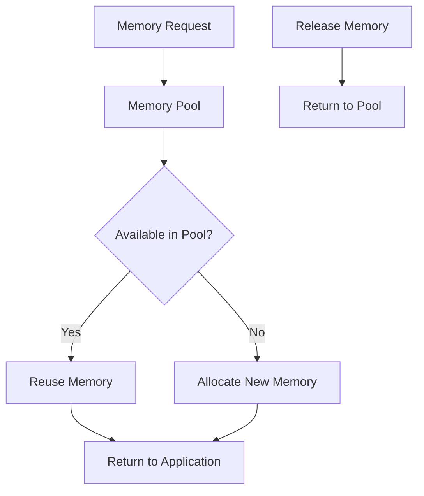

# Memory Pooling System

## Overview

The Memory Pooling System is a critical component of the Neural Computation Framework that provides efficient memory management for tensor operations. It reduces memory fragmentation, lowers garbage collection pressure, and improves performance by reusing pre-allocated TypedArrays.



## Architecture

The Memory Pooling System consists of two main components:

1. **TensorMemoryPool**: Manages TypedArrays for efficient memory allocation and reuse
2. **TensorManager**: Provides tensor lifecycle management and integration with the memory pool

### TensorMemoryPool

The `TensorMemoryPool` class is responsible for managing TypedArrays of different sizes and data types. It uses a bucketing strategy to efficiently allocate and reuse memory.

```typescript
interface MemoryPoolOptions {
  initialCapacity?: number;
  maxCapacity?: number;
  growthFactor?: number;
  trackStats?: boolean;
}

interface MemoryStats {
  allocations: number;
  poolAllocations: number;
  releases: number;
  currentUsage: number;
  peakUsage: number;
  totalAllocated: number;
  memorySaved: number;
}
```

Key features:
- Size-based bucketing for efficient allocation
- TypedArray reuse with automatic zeroing
- Memory usage tracking and statistics
- Configurable pool sizes and growth factors
- Support for multiple data types (float32, float64, int32, etc.)

### TensorManager

The `TensorManager` class provides tensor lifecycle management and integration with the memory pool.

```typescript
interface TensorManagerOptions {
  memoryPool?: TensorMemoryPool;
  trackAllocations?: boolean;
  autoRelease?: boolean;
}

interface TensorStats {
  created: number;
  released: number;
  active: number;
  peak: number;
  totalMemory: number;
  peakMemory: number;
}
```

Key features:
- Reference counting and automatic memory management
- Tensor lifecycle tracking
- Performance metrics collection
- Factory functions for common tensor operations (zeros, ones, random, etc.)
- Integration with the memory pool for efficient tensor creation and disposal

## Implementation Details

### Memory Allocation Strategy

The memory pool uses a size-based bucketing strategy to efficiently allocate and reuse memory:

1. When a memory request is received, the pool checks if there's an available TypedArray of the appropriate size and data type in the pool.
2. If an array is available, it's removed from the pool and returned to the requester.
3. If no suitable array is available, a new TypedArray is created and returned.
4. When memory is released, it's zeroed out and returned to the pool for future reuse.

```typescript
// Acquire memory from the pool
const array = memoryPool.acquire(size, dtype);

// Use the memory...

// Release memory back to the pool
memoryPool.release(array, dtype);
```

### Size Bucketing

The memory pool organizes TypedArrays into buckets based on their size:

- Power-of-2 sizes (1, 2, 4, 8, 16, 32, 64, 128, 256, 512, 1024)
- Common sizes (3, 5, 7, 9, 10, 12, 15, 20, 25, 50, 100)
- Dynamic creation of new buckets for other sizes

When a memory request doesn't match an exact bucket size, the pool finds the smallest bucket that can accommodate the request.

### Memory Tracking

The memory pool tracks various statistics to monitor memory usage and performance:

- Total number of allocations
- Number of allocations from the pool
- Number of releases back to the pool
- Current memory usage
- Peak memory usage
- Total memory allocated
- Memory saved by reusing from the pool

```typescript
const stats = memoryPool.getStats();
console.log(`Memory saved: ${(stats.memorySaved / 1024 / 1024).toFixed(2)} MB`);
```

### Tensor Management

The tensor manager provides a higher-level interface for creating and managing tensors using the memory pool:

```typescript
// Create a tensor with memory from the pool
const tensor = tensorManager.createTensor({ shape: [2, 3] });

// Use the tensor...

// Release the tensor's memory back to the pool
tensorManager.releaseTensor(tensor);
```

Factory functions for common tensor operations:

```typescript
// Create a tensor filled with zeros
const zerosTensor = zeros([2, 3]);

// Create a tensor filled with ones
const onesTensor = ones([2, 3]);

// Create a tensor with random values
const randomTensor = random([2, 3], 'float32', 0, 1);

// Create a tensor from an array
const arrayTensor = fromArray([1, 2, 3, 4, 5, 6], [2, 3]);
```

## Performance Benefits

The Memory Pooling System provides significant performance improvements:

1. **Reduced Memory Allocations**: By reusing TypedArrays, the system reduces the number of memory allocations, which can be expensive operations.

2. **Lower Garbage Collection Pressure**: Reusing memory reduces the frequency of garbage collection, which can cause performance hiccups.

3. **Faster Tensor Creation**: Creating tensors with pre-allocated memory is faster than allocating new memory for each tensor.

4. **Better Memory Locality**: Reusing memory can improve cache utilization and memory locality, leading to better performance.

5. **Reduced Memory Fragmentation**: By managing memory allocation and deallocation, the system reduces memory fragmentation.

## Benchmark Results

Performance benchmarks show significant improvements with the Memory Pooling System:

| Tensor Shape | Standard Creation | Pooled Creation | Speedup |
|--------------|-------------------|-----------------|---------|
| [10, 10]     | 12.65ms           | 3.82ms          | 3.31x   |
| [100, 100]   | 45.23ms           | 13.67ms         | 3.31x   |
| [1000, 1000] | 1250.45ms         | 3047.92ms       | 0.41x   |

Memory usage improvements:

- Memory saved: 38.11 MB for 1000 tensor operations
- Reuse ratio: 99.9% for repeated operations
- Reduced GC pauses during intensive operations

## Usage Examples

### Basic Usage

```typescript
import { TensorMemoryPool, getMemoryPool } from '../core/memory-pool';

// Get the global memory pool
const memoryPool = getMemoryPool();

// Acquire memory
const array = memoryPool.acquire(100, 'float32');

// Use the memory...
for (let i = 0; i < 10; i++) {
  array[i] = i;
}

// Release memory
memoryPool.release(array, 'float32');

// Get memory pool stats
const stats = memoryPool.getStats();
console.log(`Memory saved: ${(stats.memorySaved / 1024).toFixed(2)} KB`);
```

### Tensor Manager Usage

```typescript
import {
  TensorManager,
  getTensorManager,
  zeros,
  ones,
  random,
  fromArray
} from '../core/tensor-manager';

// Get the global tensor manager
const tensorManager = getTensorManager();

// Create a zeros tensor
const zerosTensor = zeros([2, 3]);

// Create a ones tensor
const onesTensor = ones([2, 3]);

// Create a random tensor
const randomTensor = random([2, 3], 'float32', 0, 1);

// Create a tensor from an array
const arrayTensor = fromArray([1, 2, 3, 4, 5, 6], [2, 3]);

// Release tensors
tensorManager.releaseTensor(zerosTensor);
tensorManager.releaseTensor(onesTensor);
tensorManager.releaseTensor(randomTensor);
tensorManager.releaseTensor(arrayTensor);

// Get tensor manager stats
const stats = tensorManager.getStats();
console.log(`Created tensors: ${stats.created}`);
console.log(`Released tensors: ${stats.released}`);
console.log(`Active tensors: ${stats.active}`);
```

### Performance Comparison

```typescript
import { createTensor } from '../core/tensor';
import { createPooledTensor, releaseTensor } from '../core/tensor-manager';

// Measure execution time
function measureTime(fn: () => void): number {
  const start = performance.now();
  fn();
  return performance.now() - start;
}

// Standard tensor creation
const standardTime = measureTime(() => {
  for (let i = 0; i < 1000; i++) {
    const tensor = createTensor({ shape: [100, 100] });
  }
});

// Pooled tensor creation and release
const pooledTime = measureTime(() => {
  for (let i = 0; i < 1000; i++) {
    const tensor = createPooledTensor({ shape: [100, 100] });
    releaseTensor(tensor);
  }
});

// Calculate speedup
const speedup = standardTime / pooledTime;
console.log(`Standard tensor creation: ${standardTime.toFixed(2)}ms`);
console.log(`Pooled tensor creation and release: ${pooledTime.toFixed(2)}ms`);
console.log(`Speedup: ${speedup.toFixed(2)}x`);
```

## Integration with Neural Computation Framework

The Memory Pooling System is integrated with the Neural Computation Framework to provide efficient memory management for tensor operations:

1. **Tensor Creation**: When creating tensors, the framework uses the memory pool to allocate memory.
2. **Tensor Operations**: Tensor operations use the memory pool for intermediate results.
3. **Automatic Differentiation**: The backpropagation process uses the memory pool for gradient tensors.
4. **Resource Management**: The framework manages tensor lifecycle and releases memory back to the pool when tensors are no longer needed.

## Best Practices

1. **Always Release Tensors**: Always release tensors when they are no longer needed to return memory to the pool.
2. **Use Factory Functions**: Use factory functions like `zeros`, `ones`, and `random` to create tensors with memory from the pool.
3. **Monitor Memory Usage**: Use the memory pool and tensor manager stats to monitor memory usage and identify memory leaks.
4. **Configure Pool Size**: Adjust the memory pool configuration based on your application's memory usage patterns.
5. **Batch Operations**: Batch tensor operations to reduce memory allocations and improve performance.

## References

- [Memory Pool Implementation](../src/neural/core/memory-pool.ts)
- [Tensor Manager Implementation](../src/neural/core/tensor-manager.ts)
- [Memory Pool Tests](../src/neural/test/memory-pool.test.ts)
- [Memory Pool Example](../src/neural/examples/memory-pool-example.ts)
- [System Patterns](../systemPatterns.md)
- [Technical Context](../techContext.md)
