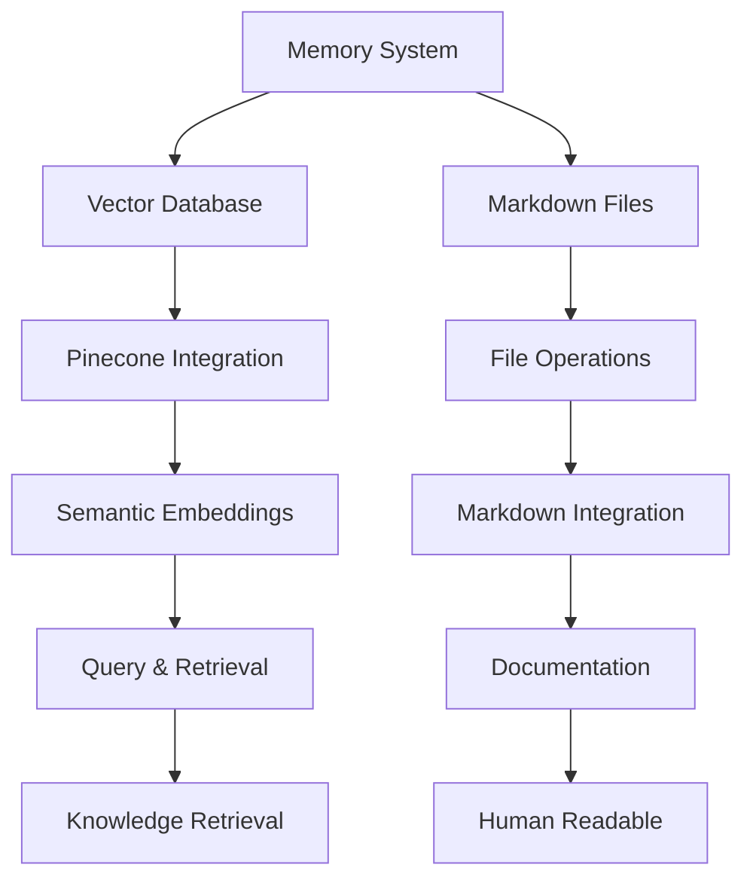

# Memory System Guide

## Overview

The Memory System is a core component of Cline's architecture that enables persistent knowledge storage and retrieval across sessions. Despite Cline's memory resetting completely between sessions, the Memory System ensures continuity by storing important information in both vector databases (Pinecone) and local markdown files.



## Core Components

### 1. Memory System (`memory-system.js`)

The core functionality that handles:
- Server management (starting/stopping)
- Memory storage and retrieval
- File processing
- Chunking text for vector storage
- Namespace management

### 2. Cline Memory Integration (`cline-memory-integration.js`)

High-level API for Cline to interact with the Memory System:
- Memory categorization (concept, pattern, decision, learning, etc.)
- Importance levels (low, medium, high, critical)
- Markdown file updates
- Simplified query interface

### 3. MCP Direct Access (`mcp-direct-access.js`)

Utility for direct access to the MCP server:
- Bypasses VSCode extension
- Provides direct communication with Pinecone
- Handles vector embeddings

## Memory Categories

The Memory System supports various categories of memories, each with specific storage locations and retrieval patterns:

| Category | Description | Storage Location | Importance Levels |
|----------|-------------|------------------|-------------------|
| Pattern | Design and implementation patterns | systemPatterns.md | low, medium, high, critical |
| Learning | Knowledge gained through experience | .clinerules | low, medium, high, critical |
| Decision | Important decisions made | activeContext.md | low, medium, high, critical |
| Concept | Core concepts and ideas | productContext.md | low, medium, high, critical |
| Preference | User preferences | .clinerules | low, medium, high, critical |
| Error | Errors to avoid | .clinerules | low, medium, high, critical |
| Interaction | User interactions | (Vector DB only) | low, medium, high, critical |

## Using the Memory System

### Initialization

```javascript
const ClimeMemoryIntegration = require('./src/scripts/cline-memory-integration');

// Initialize the system
await ClimeMemoryIntegration.initialize();
```

### Storing Memories

```javascript
// Store a pattern
await ClimeMemoryIntegration.storePattern(
  "Use the Factory pattern for creating complex objects with multiple configurations.",
  "high",
  { topic: "design-patterns", source: "documentation" }
);

// Store a learning
await ClimeMemoryIntegration.storeLearning(
  "When implementing error handling, always use try/catch blocks with specific error types.",
  "medium",
  { topic: "error-handling", source: "experience" }
);

// Store a decision
await ClimeMemoryIntegration.storeDecision(
  "Use Pinecone for vector storage to enable efficient semantic search.",
  "critical",
  { topic: "infrastructure", source: "planning" }
);

// Store a concept
await ClimeMemoryIntegration.storeMemory(
  "Vector Embeddings are numerical representations of text that capture semantic meaning.",
  {
    category: "concept",
    importance: "high",
    metadata: { topic: "ai", source: "research" }
  }
);

// Store a preference
await ClimeMemoryIntegration.storePreference(
  "Use TypeScript for new projects with a focus on strong typing.",
  "high",
  { topic: "development", source: "user" }
);

// Store an error
await ClimeMemoryIntegration.storeError(
  "Avoid using synchronous file operations in the main thread.",
  "high",
  { topic: "performance", source: "debugging" }
);
```

### Querying Memories

```javascript
// Query all knowledge
const results = await ClimeMemoryIntegration.queryKnowledge(
  "error handling best practices"
);

// Query patterns specifically
const patternResults = await ClimeMemoryIntegration.queryPatterns(
  "factory pattern"
);

// Query interactions
const interactionResults = await ClimeMemoryIntegration.queryInteractions(
  "user preferences"
);
```

### Shutting Down

```javascript
// Always shut down when done
ClimeMemoryIntegration.shutdown();
```

## Markdown Integration

The Memory System automatically updates markdown files based on the category of memory being stored:

### Pattern Storage (systemPatterns.md)

```markdown
## Implementation Patterns

### Error Handling
All errors are caught, logged, and handled appropriately.

### High Priority Pattern
Use the Factory pattern for creating complex objects with multiple configurations.
```

### Learning Storage (.clinerules)

```markdown
## Learning History

1. **Initial Setup**
   - System initialized with core files
   - Basic patterns established

2. **High Priority Learning**
   - When implementing error handling, always use try/catch blocks with specific error types.
```

### Decision Storage (activeContext.md)

```markdown
## Active Decisions

1. **Neural Computation Framework**
   - 🔄 Tensor operations implementation approach
   - 🔄 Computation graph design

2. **Critical Priority Decision**
   - Use Pinecone for vector storage to enable efficient semantic search.
```

### Concept Storage (productContext.md)

```markdown
## Core Concepts

### Memory Bank
The Memory Bank is a collection of markdown files that store documentation and knowledge.

### High Priority Concept
Vector Embeddings are numerical representations of text that capture semantic meaning.
```

## Testing the Memory System

The Memory System includes comprehensive tests to ensure it's working correctly:

1. **Unit Tests**
   - `memory-system.test.js` - Tests core functionality
   - `cline-memory-integration.test.js` - Tests high-level API
   - `memory-markdown-integration.test.js` - Tests markdown file integration

2. **Running Tests**
   - Use the `run-memory-tests.js` script to run all tests:
   ```
   node src/scripts/run-memory-tests.js
   ```

3. **Demo Script**
   - Use the `memory-system-demo.js` script to see the Memory System in action:
   ```
   node src/scripts/memory-system-demo.js
   ```

## Architecture Details

### Namespaces

The Memory System uses different namespaces in the vector database to organize memories:

- `cline-core-knowledge` - Core knowledge about the system
- `cline-patterns` - Design and implementation patterns
- `cline-interactions` - User interactions and conversations
- `cline-documentation` - Documentation and guides

### Vector Storage

Memories are stored in Pinecone as vector embeddings, which enables semantic search capabilities. The system uses OpenAI's embedding model to convert text into vectors.

### File Processing

The Memory System processes markdown files to extract knowledge and store it in the vector database. It also updates markdown files with new knowledge.

### Error Handling

The Memory System includes comprehensive error handling to ensure robustness:

- Server connection errors
- Storage and retrieval errors
- File processing errors
- Markdown update errors

## Best Practices

1. **Always initialize and shutdown properly**
   - Initialize at the start of a session
   - Shutdown at the end of a session

2. **Use appropriate categories and importance levels**
   - Categorize memories correctly for proper storage
   - Set importance levels based on relevance

3. **Include relevant metadata**
   - Add topic, source, and other relevant metadata
   - This improves search and retrieval

4. **Use specific queries**
   - Be specific in your queries for better results
   - Use domain-specific terminology

5. **Regularly review and update markdown files**
   - Ensure consistency across files
   - Remove outdated information

## Troubleshooting

### Common Issues

1. **Connection Errors**
   - Ensure the MCP server is running
   - Check API keys and credentials
   - Verify network connectivity

2. **Storage Errors**
   - Check for valid input
   - Ensure proper metadata format
   - Verify namespace existence

3. **Retrieval Errors**
   - Check query format
   - Ensure vector database is populated
   - Verify namespace existence

4. **Markdown Update Errors**
   - Check file permissions
   - Ensure file exists
   - Verify file format

### Diagnostic Tools

The Memory System includes diagnostic tools to help troubleshoot issues:

- `mcp-diagnostic-setup.js` - Sets up diagnostic tools
- `mcp-connection-test.js` - Tests connection to MCP server
- `mcp-connection-monitor.js` - Monitors connection to MCP server

## Future Enhancements

1. **Enhanced Semantic Search**
   - Improved query understanding
   - Context-aware search

2. **Automated Knowledge Extraction**
   - Extract knowledge from conversations
   - Identify patterns automatically

3. **Knowledge Graph Integration**
   - Connect related memories
   - Visualize knowledge relationships

4. **Adaptive Importance Levels**
   - Automatically adjust importance based on usage
   - Decay importance over time for outdated information

5. **Multi-modal Memory Storage**
   - Support for images, code snippets, and other media
   - Enhanced retrieval of multi-modal content
