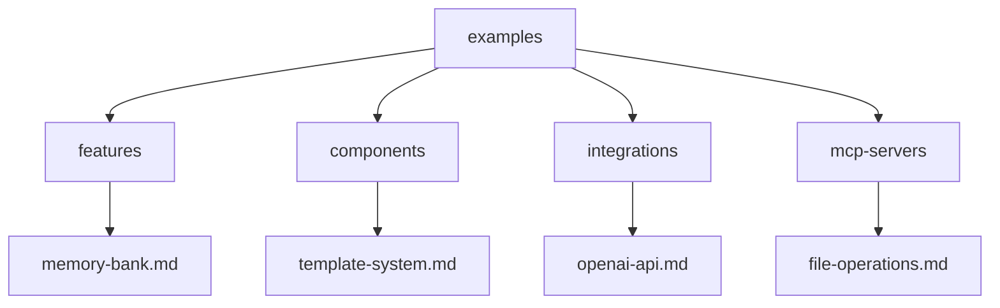

# Documentation Examples

## Overview
This directory contains example documentation created using the Memory Bank's standard templates. These examples demonstrate proper usage of templates, formatting conventions, and documentation best practices.

## Directory Structure

## Available Examples

### Feature Documentation
- [Memory Bank System](features/memory-bank.md)
  - Demonstrates feature documentation
  - Shows requirements tracking
  - Includes technical design
  - Documents testing strategy

### Component Documentation
- [Template System](components/template-system.md)
  - Shows interface documentation
  - Includes usage examples
  - Documents error handling
  - Demonstrates testing approach

### API Integration Documentation
- [OpenAI Integration](integrations/openai-api.md)
  - Shows authentication setup
  - Documents endpoints
  - Includes error handling
  - Covers rate limiting

### MCP Server Documentation
- [File Operations Server](mcp-servers/file-operations.md)
  - Documents tools and resources
  - Shows configuration
  - Includes protocol details
  - Covers deployment

## Usage Guidelines

### 1. Template Selection
- Choose the appropriate template based on what you're documenting
- Use feature.md for major features
- Use component.md for reusable components
- Use api-integration.md for external services
- Use mcp-server.md for MCP servers

### 2. Content Organization
- Follow the template structure
- Include all required sections
- Add optional sections as needed
- Maintain consistent formatting

### 3. Documentation Style
- Use clear, concise language
- Include relevant examples
- Add diagrams where helpful
- Keep content focused

### 4. Best Practices
- Regular updates
- Version tracking
- Cross-referencing
- Validation checks

## Template References
- [Feature Template](../templates/documentation/feature.md)
- [Component Template](../templates/documentation/component.md)
- [API Integration Template](../templates/documentation/api-integration.md)
- [MCP Server Template](../templates/documentation/mcp-server.md)

## Notes
- Examples are kept up to date
- Follow these patterns for new documentation
- Suggest improvements via issues
- Update examples as templates evolve
