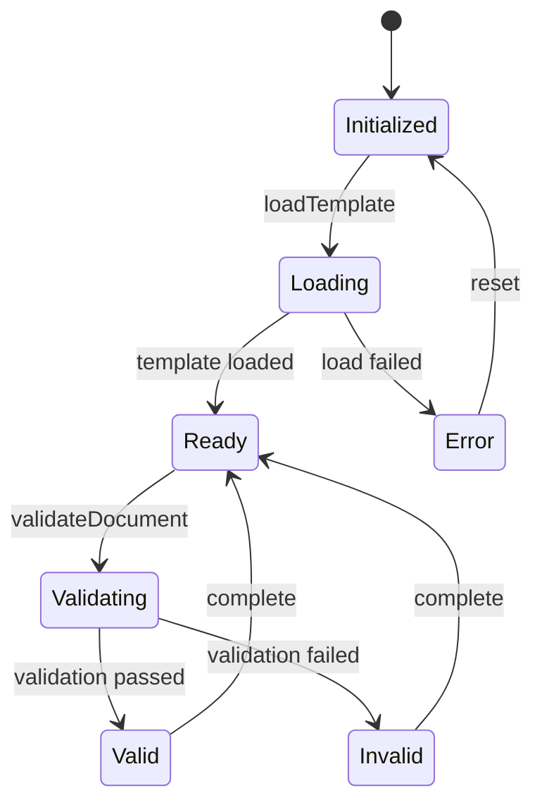

# Component: Template System

## Purpose
The Template System provides standardized documentation templates and manages their usage across the Memory Bank system. It ensures consistency, completeness, and proper structure in all documentation while supporting extensibility for new template types.

## Interface
```typescript
interface TemplateSystem {
    // Core methods
    loadTemplate(type: TemplateType): Promise<Template>;
    validateDocument(doc: Document, type: TemplateType): Promise<ValidationResult>;
    createDocument(type: TemplateType, data: DocumentData): Promise<Document>;

    // Properties
    availableTemplates: TemplateType[];
    validationRules: ValidationRule[];
}

interface Template {
    type: TemplateType;
    structure: TemplateStructure;
    required: string[];
    optional: string[];
    validate(content: any): ValidationResult;
}

type TemplateType = 'feature' | 'component' | 'api-integration' | 'mcp-server';

interface ValidationResult {
    isValid: boolean;
    errors: ValidationError[];
    warnings: ValidationWarning[];
}
```

## Dependencies
- **Markdown Parser**
  - Purpose: Parse and validate markdown content
  - Version: marked@5.0.0
  - Import: `import { marked } from 'marked';`

- **Mermaid Processor**
  - Purpose: Validate and process mermaid diagrams
  - Version: mermaid@10.0.0
  - Import: `import mermaid from 'mermaid';`

- **File System**
  - Purpose: Read template files and write documents
  - Version: Node.js fs/promises
  - Import: `import { promises as fs } from 'fs';`

## Usage Example
```typescript
// Initialize template system
const templateSystem = new TemplateSystem({
    templatesDir: './templates',
    validationRules: defaultRules
});

// Create a new feature document
const featureDoc = await templateSystem.createDocument('feature', {
    name: 'Memory Bank',
    overview: 'A documentation system...',
    requirements: [/* ... */]
});

// Validate an existing document
const validationResult = await templateSystem.validateDocument(
    existingDoc,
    'component'
);

if (!validationResult.isValid) {
    console.error('Validation failed:', validationResult.errors);
}
```

## Error Handling
```typescript
try {
    const template = await templateSystem.loadTemplate('feature');
} catch (error) {
    if (error instanceof TemplateNotFoundError) {
        // Handle missing template
        await createDefaultTemplate('feature');
    } else if (error instanceof ValidationError) {
        // Handle invalid template structure
        await repairTemplate('feature');
    } else {
        // Handle unexpected errors
        throw new TemplateSystemError('Template loading failed', error);
    }
}
```

## Events
| Event Name | Trigger | Payload | Purpose |
|------------|---------|---------|----------|
| template.loaded | Template load | `{ type: TemplateType }` | Track template usage |
| doc.created | Document creation | `{ type: TemplateType, path: string }` | Monitor creation |
| validation.failed | Validation error | `{ errors: ValidationError[] }` | Error tracking |
| template.updated | Template change | `{ type: TemplateType, changes: Change[] }` | Version control |

## State Management


## Performance Considerations
- Time complexity: O(n) for validation where n is document size
- Space complexity: O(m) where m is template size
- Template caching implemented
- Lazy loading of templates

## Testing
```typescript
describe('TemplateSystem', () => {
    it('should load templates correctly', async () => {
        const system = new TemplateSystem();
        const template = await system.loadTemplate('feature');
        expect(template).toBeDefined();
        expect(template.type).toBe('feature');
    });

    it('should validate documents correctly', async () => {
        const system = new TemplateSystem();
        const result = await system.validateDocument(testDoc, 'component');
        expect(result.isValid).toBe(true);
    });
});
```

## Security Considerations
- Input validation on all template content
- File path sanitization
- Content sanitization
- Access control checks

## Configuration
```typescript
interface TemplateSystemConfig {
    templatesDir: string;
    validationRules: ValidationRule[];
    caching: {
        enabled: boolean;
        maxAge: number;
        maxSize: number;
    };
    security: {
        allowHtml: boolean;
        allowScripts: boolean;
        maxSize: number;
    };
}
```

## Lifecycle
1. Initialization
   - Load configuration
   - Initialize cache
   - Register templates

2. Operation
   - Template loading
   - Document creation
   - Validation
   - Event emission

3. Cleanup
   - Cache clearing
   - Resource release
   - State reset

## Related Components
- Document Manager: Uses templates for document creation
- Validation System: Provides validation rules
- File System: Handles file operations

## Known Issues
- Template hot-reload not implemented
- Large document validation performance
- Cache invalidation edge cases

## Future Improvements
- [ ] Add template hot-reload
- [ ] Implement template inheritance
- [ ] Add custom validation rules
- [ ] Improve caching strategy

## Version History
| Version | Changes | Breaking Changes |
|---------|---------|-----------------|
| 1.0.0 | Initial implementation | N/A |
| 1.1.0 | Added caching | None |
| 1.2.0 | Enhanced validation | None |

## Notes
- Templates are stored in markdown format
- Validation rules are extensible
- Event system enables monitoring
- Cache improves performance
