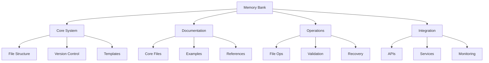

# Feature: Memory Bank System

## Overview
The Memory Bank is a comprehensive documentation and memory persistence system designed to maintain perfect documentation across sessions. It serves as the central knowledge repository, enabling consistent and effective operation despite complete memory resets between sessions.

## Requirements
- [x] Core documentation structure
  - Hierarchical file organization
  - Clear cross-referencing
  - Version control support
  - Template system

- [x] Documentation templates
  - Feature documentation
  - Component documentation
  - API integration
  - MCP server

- [ ] File operations
  - Basic read/write
  - Validation checks
  - Error handling
  - Recovery procedures

- [ ] Integration features
  - API connections
  - External services
  - Monitoring system
  - Health checks

## Technical Design

### Components
- **Core System**
  - Purpose: Manage file structure and version control
  - Responsibilities: File organization, history tracking
  - Dependencies: Git, file system

- **Documentation System**
  - Purpose: Maintain documentation hierarchy
  - Responsibilities: Templates, validation, updates
  - Dependencies: Markdown, Mermaid

- **Operations System**
  - Purpose: Handle file operations
  - Responsibilities: Read/write, validation, recovery
  - Dependencies: File system, error handling

- **Integration System**
  - Purpose: Connect external services
  - Responsibilities: API connections, monitoring
  - Dependencies: OpenAI, Pinecone

## Implementation Details

### Key Files
- `projectbrief.md` - Foundation document defining core requirements
- `productContext.md` - Defines project purpose and goals
- `systemPatterns.md` - Documents system architecture
- `techContext.md` - Defines technical environment
- `activeContext.md` - Tracks current work focus
- `progress.md` - Tracks project progress

### Data Flow
1. User initiates documentation request
2. System loads relevant templates
3. Content validation occurs
4. File operations execute
5. Version control updates
6. Integration services notified

### Error Handling
| Error Scenario | Handling Strategy | Recovery Process |
|----------------|------------------|------------------|
| File not found | Search alternates | Create from template |
| Invalid content | Validation error | Restore from history |
| API failure | Retry with backoff | Use cached data |
| System crash | Auto-save trigger | Recover from backup |

## Testing Strategy

### Unit Tests
- [ ] File operations
  - Read operations
  - Write operations
  - Error conditions
  - Recovery procedures

- [ ] Documentation system
  - Template loading
  - Content validation
  - Cross-referencing
  - Version control

### Integration Tests
- [ ] System workflow
  - End-to-end documentation
  - Template usage
  - Error recovery
  - Version control

- [ ] External services
  - API connections
  - Service integration
  - Monitoring system
  - Health checks

## Validation Checklist
- [x] Core documentation complete
- [x] Templates created
- [x] Directory structure set
- [x] Version control configured
- [ ] File operations tested
- [ ] Error handling verified
- [ ] Integration tested
- [ ] Performance validated

## Related Documents
- [Project Brief](../../projectbrief.md)
- [Product Context](../../productContext.md)
- [System Patterns](../../systemPatterns.md)
- [Technical Context](../../techContext.md)

## Status History
| Date | Status | Notes |
|------|--------|-------|
| 2025-02-24 | In Progress | Core documentation complete |
| 2025-02-24 | In Progress | Templates created |
| 2025-02-24 | In Progress | Example documentation started |

## Notes
- The system is designed to be self-documenting and self-maintaining
- All documentation follows strict templates for consistency
- Version control ensures no information is lost
- Integration capabilities allow for future expansion
