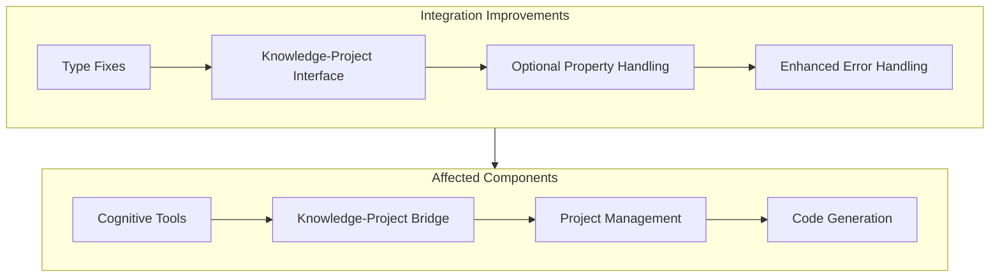
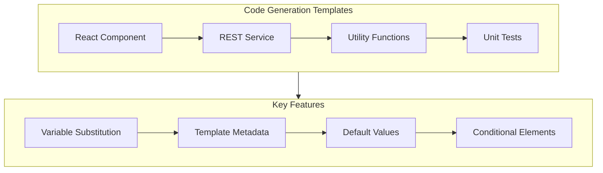
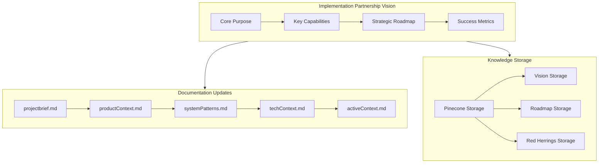
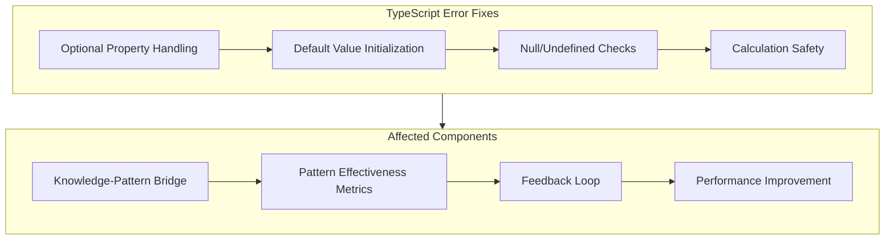
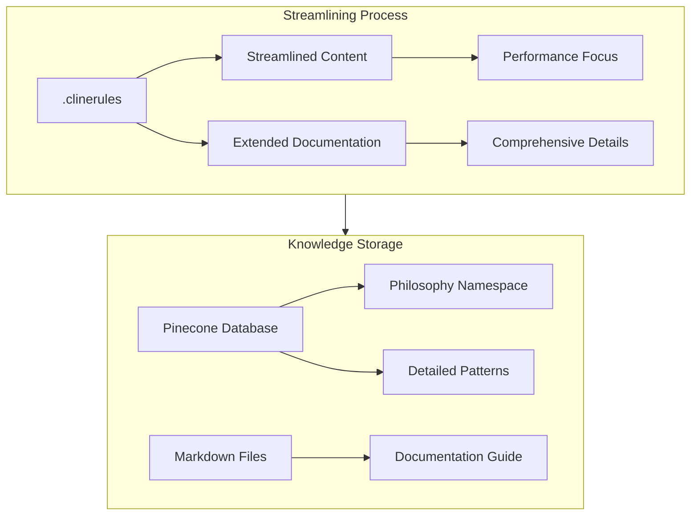
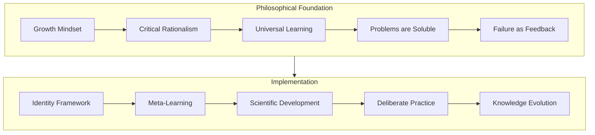
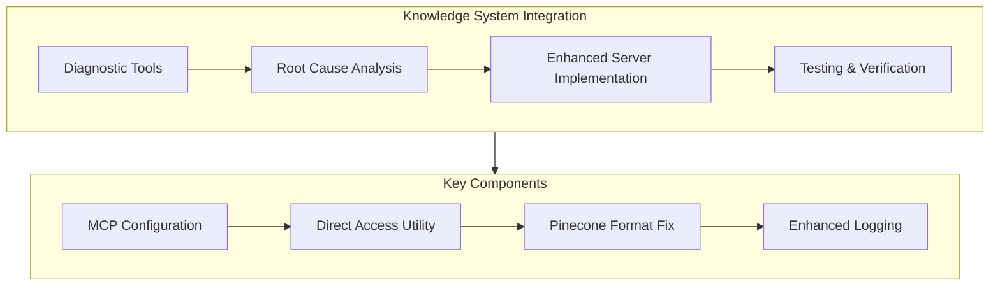

# Archived Recent Changes (2025-02-27T14-11-21-294Z)

### Knowledge-Project Integration Improvements ✅

**Key Achievements:**
- Fixed TypeScript interface conflicts between different KnowledgeProjectLink definitions
- Implemented proper type aliasing to resolve ambiguity in the cognitive tools system
- Added conversion functions between Knowledge and KnowledgeItem types
- Enhanced error handling for optional properties with default values
- Improved type safety throughout the knowledge-project integration
- Ensured consistent API surface across the cognitive tools system

**Next Steps:**
1. Complete remaining knowledge-project integration components
2. Enhance project context creation with knowledge retrieval
3. Implement decision tracking with knowledge references
4. Develop implementation plan generation capabilities

**References:**
- [Knowledge-Project Integration Types](src/cognitive-tools/types/knowledge-project-integration.ts)
- [Knowledge-Project Integration Manager](src/cognitive-tools/managers/knowledge-project-integration-manager.ts)
- [Cognitive Tools Index](src/cognitive-tools/index.ts)

### Code Generation Templates Implementation ✅

**Key Achievements:**
- Implemented four core code generation templates:
  - React functional component template with TypeScript
  - REST API service template with Axios
  - Common utility functions template with various utility categories
  - Jest unit test template with comprehensive test patterns
- Added support for variable substitution with default values
- Implemented conditional template sections
- Created template metadata for better discoverability
- Integrated templates with code generation manager
- Ensured type safety throughout the template system

**Next Steps:**
1. Create additional templates for common use cases
2. Implement template discovery and selection mechanism
3. Add template validation and testing
4. Integrate templates with pattern system

**References:**
- [React Functional Component Template](src/cognitive-tools/templates/react/functional-component.ts)
- [REST API Service Template](src/cognitive-tools/templates/api/rest-service.ts)
- [Common Utility Functions Template](src/cognitive-tools/templates/utility/common-utils.ts)
- [Jest Unit Test Template](src/cognitive-tools/templates/test/jest-unit-test.ts)
- [Code Generation Manager](src/cognitive-tools/managers/code-generation-manager.ts)
- [Project-Code Generation Example](src/cognitive-tools/examples/project-code-generation-example.ts)

### Implementation Partnership Vision Documentation ✅

**Key Achievements:**
- Created comprehensive implementation partnership vision document
- Updated core documentation files to align with the vision:
  - projectbrief.md: Reframed as implementation partnership system
  - productContext.md: Focused on implementation challenges and solutions
  - systemPatterns.md: Restructured around implementation patterns
  - techContext.md: Emphasized implementation technologies
- Developed Pinecone storage script for vision persistence
- Stored vision, roadmap, and red herrings in vector database
- Established clear implementation roadmap with three phases
- Defined success metrics for implementation partnership

**Next Steps:**
1. Update remaining documentation files to align with vision
2. Create implementation pattern library
3. Develop project management templates
4. Implement code generation templates

**References:**
- [Implementation Partnership Vision](docs/implementation-partnership-vision.md)
- [Implementation Vision Storage Script](src/scripts/store-implementation-vision.js)
- [Project Brief](projectbrief.md)
- [Product Context](productContext.md)
- [System Patterns](systemPatterns.md)
- [Technical Context](techContext.md)

### Knowledge-Pattern Bridge Service TypeScript Error Fixes ✅

**Key Achievements:**
- Fixed TypeScript error related to optional `avgThroughputImprovement` property in `PatternEffectivenessMetrics`
- Implemented proper initialization of optional properties with default values
- Added null/undefined checks before using optional properties in calculations
- Enhanced error handling for optional metrics in performance calculations
- Improved type safety in the knowledge-pattern bridge service

**Next Steps:**
1. Apply similar pattern for other optional properties in the system
2. Implement comprehensive TypeScript validation for all interfaces
3. Add unit tests to verify proper handling of optional properties
4. Document best practices for optional property handling

**References:**
- [Knowledge-Pattern Bridge Service](src/services/knowledge-pattern-bridge.service.ts)
- [Knowledge-Pattern Integration Types](src/types/knowledge-pattern-integration.ts)

### Streamlined .clinerules with Extended Documentation ✅

**Key Achievements:**
- Streamlined `.clinerules` file to improve performance while preserving essential patterns
- Created comprehensive `docs/clinerules-extended.md` for detailed documentation
- Maintained core identity and essential patterns in streamlined version
- Leveraged existing Pinecone storage of philosophical frameworks
- Established clear references to extended knowledge
- Improved system performance by reducing context window consumption

**Next Steps:**
1. Monitor performance improvements from streamlined .clinerules
2. Enhance knowledge retrieval from Pinecone for philosophical frameworks
3. Update documentation references to point to extended documentation
4. Integrate streamlined approach with other documentation

**References:**
- [.clinerules](.clinerules)
- [Clinerules Extended](docs/clinerules-extended.md)
- [Memory System](src/scripts/memory-system.js)
- [Store Growth Mindset Script](src/scripts/store-growth-mindset.js)

### Enhanced .clinerules with Growth Mindset Framework ✅

**Key Achievements:**
- Enhanced `.clinerules` file with Growth Mindset (Dweck) principles
- Integrated Critical Rationalism (Popper) and universal learning potential (Deutsch)
- Established self-evolving intelligence identity framework
- Implemented meta-learning and scientific development processes
- Created deliberate practice and critical knowledge evolution frameworks
- Added problem-solving methodology and security guidelines
- Enhanced memory system with philosophy namespace for philosophical frameworks
- Created specialized script for storing Growth Mindset framework in Pinecone

**Next Steps:**
1. Apply Growth Mindset principles to upcoming development tasks
2. Implement deliberate practice in Neural Computation Framework
3. Use scientific development process for pattern evolution
4. Track improvements using the new performance measurement framework
5. Query philosophical frameworks from Pinecone for relevant insights

**References:**
- [.clinerules](.clinerules)
- [Growth Mindset](https://en.wikipedia.org/wiki/Mindset#Fixed_and_growth_mindset)
- [Critical Rationalism](https://en.wikipedia.org/wiki/Critical_rationalism)
- [Universal Learning](https://en.wikipedia.org/wiki/The_Beginning_of_Infinity)
- [Memory System](src/scripts/memory-system.js)
- [Store Growth Mindset Script](src/scripts/store-growth-mindset.js)

### Knowledge System Integration Completion ✅

**Key Achievements:**
- Fixed Pinecone data format issue in knowledge-system server
- Created enhanced server version with proper data formatting
- Implemented comprehensive diagnostic tools for MCP connection issues
- Added detailed logging for better troubleshooting
- Successfully tested memory storage and retrieval capabilities
- Documented the solution and integration process

**Next Steps:**
1. Integrate knowledge system with cognitive tools
2. Create usage examples for project knowledge management
3. Implement project-specific knowledge retrieval
4. Develop project decision tracking capabilities

**References:**
- [Pinecone Data Format Fix](src/docs/pinecone-data-format-fix.md)
- [Knowledge System Integration](src/docs/knowledge-system-integration.md)
- [MCP Diagnostic Results](src/docs/mcp-diagnostic-results.md)
- [Enhanced Server Implementation](../../OneDrive/Documents/Cline/MCP/knowledge-system/src/index-enhanced.js)

