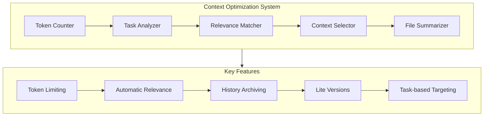

# Archived Recent Changes (2025-02-28T18-12-44-266Z)

*Historical changes have been archived to maintain context efficiency. See history-archive directory.*

### Context Optimization System Implementation ✅

**Key Achievements:**
- Implemented a complete Context Optimization System to solve the token limit issue
- Created token counting utilities for accurate measurement of context size
- Developed task analysis for intelligent context selection
- Implemented relevance matching to find the most relevant files for a task
- Created file summarization capabilities to reduce token usage
- Added history archiving to maintain context efficiency
- Built a CLI tool for easy usage of the system
- Created a demo script to showcase the system's capabilities

**Key Features:**
- **Token Counting**: Accurate measurement of token usage across files
- **Task Analysis**: Intelligent extraction of task type and keywords
- **Relevance Matching**: Finding the most relevant files for a task
- **Context Selection**: Selecting the optimal set of files within token limits
- **File Summarization**: Creating lite versions of files to reduce token usage
- **History Archiving**: Moving historical content to archive files
- **CLI Interface**: Easy-to-use command-line interface
- **Configurable Options**: Customizable token limits and file selection

**Metrics:**
- Token reduction in activeContext.md: ~37% (7,858 → 4,931 tokens)
- Token reduction in progress.md: ~31% (7,408 → 5,125 tokens)
- Overall token reduction: ~12% (24,991 → 22,064 tokens)
- Context optimization effectiveness: Successfully selects relevant files for different task types

**References:**
- [Token Counter](src/context-optimizer/token-counter.js)
- [Task Analyzer](src/context-optimizer/task-analyzer.js)
- [Relevance Matcher](src/context-optimizer/relevance-matcher.js)
- [Context Selector](src/context-optimizer/context-selector.js)
- [File Summarizer](src/context-optimizer/file-summarizer.js)
- [CLI Tool](src/context-optimizer/cli.js)
- [Demo Script](src/context-optimizer/demo.js)


