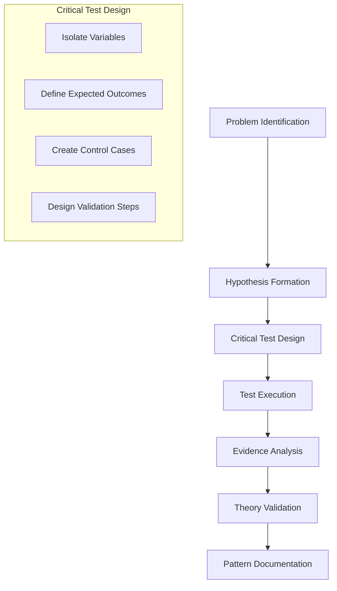

# Critical Test Methodology

## Overview

The Critical Test Methodology is a systematic approach to problem-solving that emphasizes the design and execution of decisive tests to validate hypotheses. This pattern is particularly valuable when dealing with complex system issues where multiple factors could be contributing to the problem.



## Core Components

### 1. Problem Space Analysis
```mermaid
flowchart LR
    subgraph Problem Space
        P1[Issue Identification]
        P2[Impact Analysis]
        P3[Scope Definition]
    end

    subgraph Test Design
        T1[Variable Isolation]
        T2[Control Environment]
        T3[Success Criteria]
    end

    subgraph Evidence Collection
        E1[Test Execution]
        E2[Data Collection]
        E3[Result Analysis]
    end

    Problem Space --> Test Design
    Test Design --> Evidence Collection
    Evidence Collection --> Problem Space
```

### 2. Methodology Steps

1. **Problem Identification**
   - Clear description of the issue
   - Observable symptoms
   - Impact assessment
   - Scope definition

2. **Hypothesis Formation**
   - Potential cause analysis
   - Contributing factors
   - System dependencies
   - Environmental considerations

3. **Critical Test Design**
   - Variable isolation
   - Control environment setup
   - Success criteria definition
   - Validation steps

4. **Test Execution**
   - Controlled environment
   - Step-by-step process
   - Data collection
   - Result documentation

5. **Evidence Analysis**
   - Data interpretation
   - Pattern recognition
   - Correlation analysis
   - Causation verification

6. **Theory Validation**
   - Hypothesis confirmation
   - Alternative explanations
   - Edge case testing
   - Solution verification

7. **Pattern Documentation**
   - Solution documentation
   - Pattern recognition
   - Knowledge base update
   - Future reference

## Implementation Example

### Test System Resolution Case Study

1. **Problem Identification**
   - Symptom: Jest tests hanging indefinitely
   - Impact: Blocking Phase 2 implementation
   - Scope: Test infrastructure

2. **Hypothesis Formation**
   - Theory: Resource cleanup issue in test environment
   - Factors: Async operations, cleanup timing
   - Dependencies: Cache system, rate limiter

3. **Critical Test Design**
   - Variable: NODE_ENV-based cleanup control
   - Control: Disable automatic cleanup in test environment
   - Success: Tests complete within timeout

4. **Test Execution**
   - Implementation: Conditional cleanup logic
   - Environment: Test-specific configuration
   - Monitoring: Process completion

5. **Evidence Analysis**
   - Result: Tests completing successfully
   - Pattern: Environment-specific behavior
   - Correlation: Cleanup and test completion

6. **Theory Validation**
   - Confirmation: Environment-aware resource management
   - Edge Cases: Multiple test suites
   - Solution: Implemented in cache system

7. **Pattern Documentation**
   - Solution: Environment-based cleanup strategy
   - Pattern: Test environment isolation
   - Knowledge: Resource management patterns

## Best Practices

1. **Test Design**
   - Isolate variables effectively
   - Create clear control cases
   - Define measurable outcomes
   - Document assumptions

2. **Execution**
   - Follow systematic process
   - Collect comprehensive data
   - Monitor side effects
   - Document all steps

3. **Analysis**
   - Use data-driven approach
   - Consider alternative explanations
   - Validate assumptions
   - Document findings

4. **Documentation**
   - Clear problem description
   - Detailed solution steps
   - Pattern recognition
   - Future recommendations

## Application Guidelines

1. **When to Use**
   - Complex system issues
   - Multiple potential causes
   - Need for systematic approach
   - Pattern recognition required

2. **Key Considerations**
   - Problem complexity
   - System dependencies
   - Resource constraints
   - Time limitations

3. **Success Metrics**
   - Clear problem resolution
   - Pattern identification
   - Knowledge capture
   - Future prevention

## Related Patterns

1. **Testing Patterns**
   - Test isolation
   - Environment configuration
   - Resource management
   - Error handling

2. **System Patterns**
   - Error detection
   - Resource cleanup
   - State management
   - Event handling

3. **Documentation Patterns**
   - Problem documentation
   - Solution capture
   - Pattern recognition
   - Knowledge sharing
