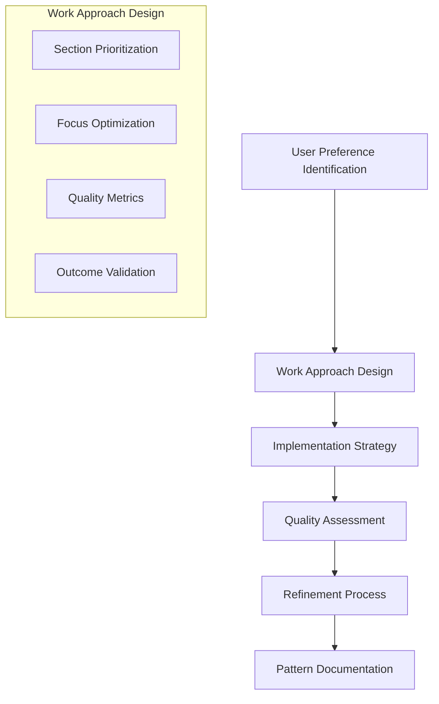
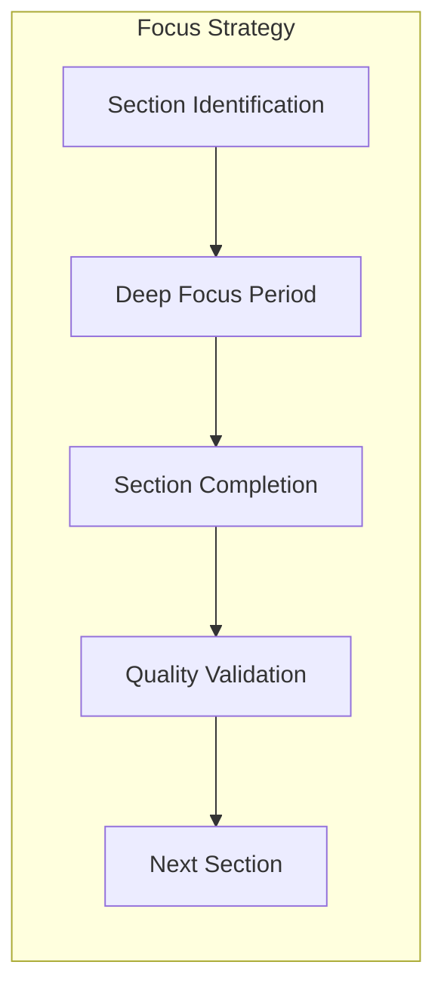
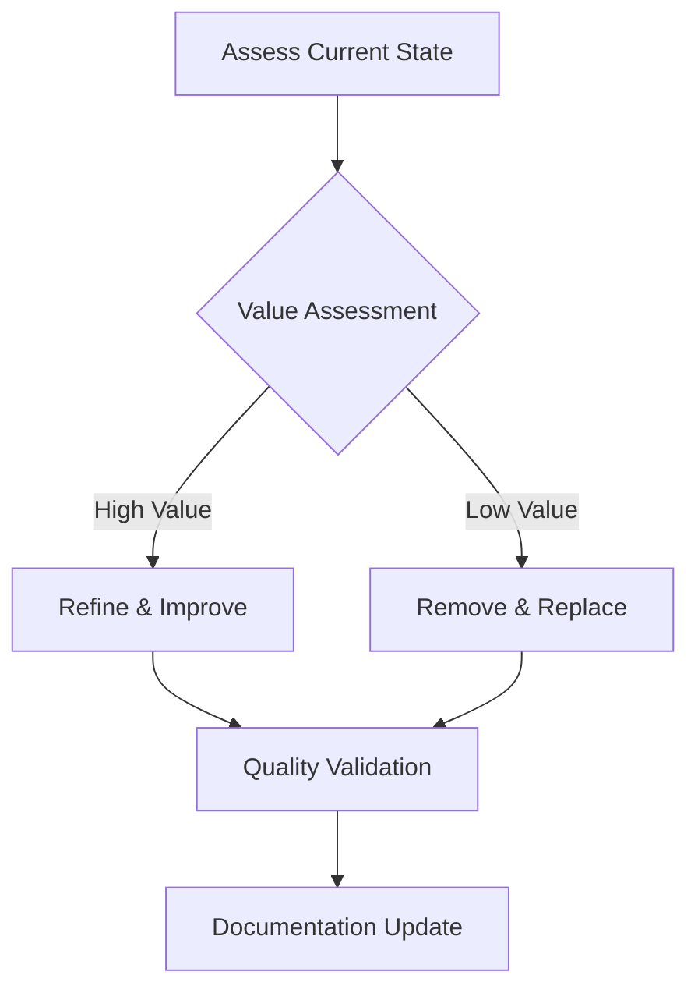
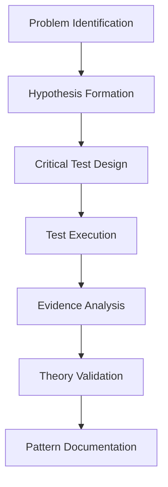
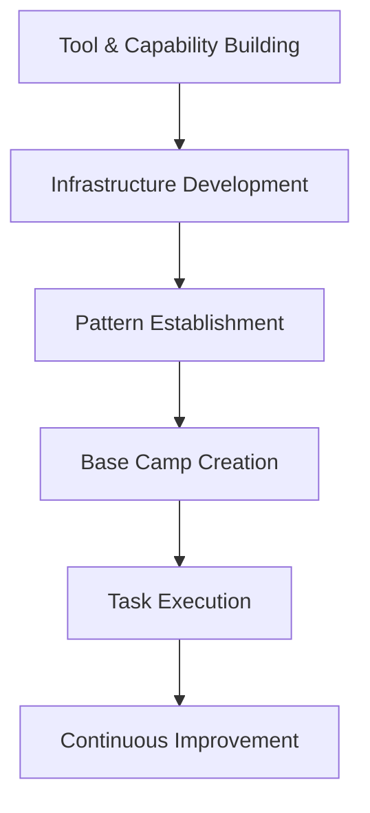
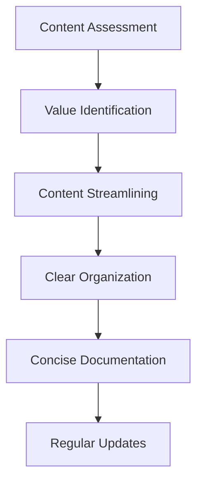

# User Preference Patterns

## Overview

This document captures key user preferences and work approach patterns that have proven effective in our development process. These patterns reflect a philosophy that prioritizes quality, efficiency, and practical results over theoretical completeness or preservation of existing work.

## Core Patterns

### 1. Heads-Down, Focused Work Approach

**Key Principles:**
- Break work into discrete, focused sections
- Complete each section fully before moving to the next
- Minimize context switching
- Maintain deep focus during implementation
- Validate quality before proceeding

**Implementation:**
- Identify clear section boundaries
- Allocate uninterrupted time blocks
- Eliminate distractions during focus periods
- Complete validation before moving on
- Document completed sections immediately

**Benefits:**
- Higher quality output
- Reduced cognitive load
- More efficient implementation
- Clearer progress tracking
- Better error detection

### 2. Quality Over Preservation

**Key Principles:**
- Willingness to cut/change regardless of prior effort
- Value-based decision making
- Quality as the primary metric
- No attachment to existing implementations
- Outcome-focused assessment

**Implementation:**
- Regular value assessment of existing work
- Honest evaluation of implementation quality
- Willingness to discard non-optimal solutions
- Focus on end results rather than effort expended
- Clear documentation of decisions

**Benefits:**
- Higher overall quality
- More efficient resource allocation
- Reduced technical debt
- Cleaner codebase
- Better long-term outcomes

### 3. Critical Test Methodology

**Key Principles:**
- Systematic approach to problem-solving
- Evidence-based decision making
- Clear hypothesis formation
- Decisive testing methodology
- Pattern recognition and documentation

**Implementation:**
- Clear problem definition
- Multiple hypothesis consideration
- Controlled testing environment
- Comprehensive data collection
- Thorough analysis of results
- Documentation of findings

**Benefits:**
- More accurate problem resolution
- Reduced debugging time
- Pattern identification for future issues
- Knowledge preservation
- Systematic approach to complex problems

### 4. Practical Capability Focus

**Key Principles:**
- Focus on what works today over theoretical completeness
- Practical value as the primary metric
- Demonstrable capabilities over aspirational goals
- Clear examples of functional components
- Integration of working components

**Implementation:**
- Honest capability assessment
- Prioritization based on practical value
- Development of demonstrable features
- Clear examples and documentation
- Integration with existing systems

**Benefits:**
- Faster time to value
- Clearer progress tracking
- Better resource allocation
- More accurate documentation
- Improved user satisfaction

### 5. Axe Sharpening Philosophy

**Key Principles:**
- "If I had six hours to chop down a tree, I'd spend the first four sharpening the axe"
- Building capabilities before tackling specific tasks
- Infrastructure investment before feature development
- Pattern establishment before implementation
- Foundation before expansion

**Implementation:**
- Identify required capabilities
- Develop robust infrastructure
- Establish clear patterns
- Create a solid foundation
- Execute tasks with prepared tools

**Benefits:**
- More efficient task execution
- Higher quality outcomes
- Reduced rework
- Scalable solutions
- Consistent implementation

### 6. Honest Assessment Mindset

**Key Principles:**
- Accurate representation of implementation status
- No inflation of progress
- Clear identification of gaps
- Honest evaluation of quality
- Transparent communication

**Implementation:**
- Regular implementation reviews
- Accurate status reporting
- Clear status indicators (✅, 🔄, ❌)
- Gap identification and documentation
- Prioritization based on honest assessment

**Benefits:**
- More accurate planning
- Better resource allocation
- Improved trust and communication
- Clearer priorities
- More effective problem resolution

### 7. Streamlined Documentation

**Key Principles:**
- Concise, accurate documentation
- Value-based content decisions
- Elimination of redundancy
- Clear organization and structure
- Regular updates and maintenance

**Implementation:**
- Regular documentation review
- Removal of redundant information
- Simplification of complex explanations
- Clear organization and structure
- Focus on practical examples

**Benefits:**
- More usable documentation
- Reduced maintenance burden
- Improved clarity
- Better knowledge transfer
- More accurate information

## Project Examples

### Neural Computation Framework

**Application of Patterns:**
1. **Heads-Down, Focused Work Approach**
   - Implemented tensor operations section by section
   - Completed each component before moving to the next
   - Maintained deep focus during implementation

2. **Quality Over Preservation**
   - Simplified computation graph implementation
   - Removed unnecessary complexity in tensor operations
   - Focused on core functionality over theoretical completeness

3. **Practical Capability Focus**
   - Prioritized working tensor operations over complete framework
   - Developed demonstrable examples
   - Created clear documentation of functional components

4. **Honest Assessment Mindset**
   - Accurately reported implementation status (40% complete)
   - Clearly identified gaps in automatic differentiation
   - Prioritized next steps based on honest assessment

### Memory System Implementation

**Application of Patterns:**
1. **Axe Sharpening Philosophy**
   - Built knowledge system integration before specific features
   - Developed diagnostic tools for troubleshooting
   - Created solid foundation for memory operations

2. **Critical Test Methodology**
   - Identified Pinecone data format issue
   - Developed hypothesis about cause
   - Created targeted tests to validate solution
   - Implemented and verified fix

3. **Streamlined Documentation**
   - Created concise memory system guide
   - Focused on practical examples
   - Eliminated redundant information
   - Maintained clear organization

4. **Practical Capability Focus**
   - Implemented core memory functionality
   - Created high-level API for integration
   - Developed demonstration script
   - Integrated with markdown files

## Implementation Guidelines

### When to Apply

1. **Project Initialization**
   - Establish work patterns early
   - Set quality expectations
   - Define documentation standards
   - Create assessment framework

2. **Complex Problem Solving**
   - Apply critical test methodology
   - Use heads-down focus approach
   - Implement honest assessment
   - Document findings and patterns

3. **Refactoring and Optimization**
   - Apply quality over preservation
   - Use practical capability focus
   - Implement streamlined documentation
   - Maintain honest assessment

4. **Documentation Updates**
   - Apply streamlined documentation principles
   - Focus on practical examples
   - Eliminate redundancy
   - Maintain clear organization

### Success Metrics

1. **Implementation Quality**
   - Higher code quality
   - Reduced technical debt
   - Fewer bugs and issues
   - More maintainable codebase

2. **Development Efficiency**
   - Faster implementation of key features
   - Reduced rework
   - More efficient problem resolution
   - Better resource allocation

3. **Documentation Effectiveness**
   - More usable documentation
   - Better knowledge transfer
   - Reduced maintenance burden
   - Improved clarity

4. **Problem Resolution**
   - Faster issue identification
   - More accurate problem diagnosis
   - More effective solutions
   - Better pattern recognition

## Related Patterns

1. **Development Workflow**
   - [Development Workflow Patterns](./development-workflow.md)
   - Complements with structured development approach

2. **Critical Testing**
   - [Critical Test Methodology](./critical-test-methodology.md)
   - Provides systematic problem-solving framework

3. **Error Handling**
   - [Error Handling Patterns](../coding/error-handling.md)
   - Supports quality-focused implementation

## Cross-References

- [Project Brief](../../projectbrief.md)
- [Active Context](../../activeContext.md)
- [Progress Tracking](../../progress.md)
- [System Patterns](../../systemPatterns.md)
