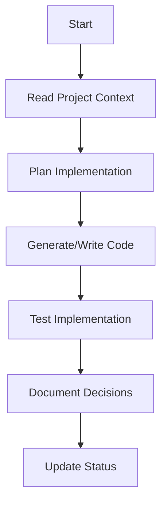
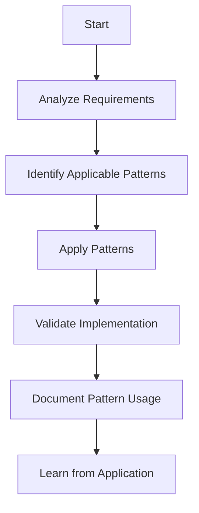
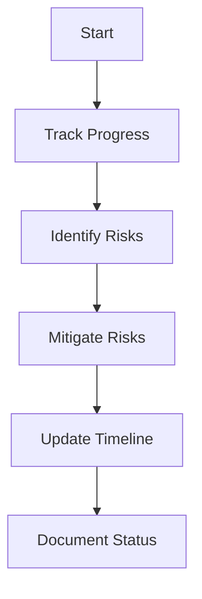

# Product Context

## Problem Statement

Cline, as an implementation partner, faces a unique challenge: translating ideas into code and managing projects effectively despite complete memory reset between sessions. This creates significant challenges:

1. **Implementation Continuity**
   - Loss of project context between sessions
   - Need to relearn implementation details
   - Risk of inconsistent implementation decisions
   - Difficulty maintaining momentum on complex projects

2. **Project Management Challenges**
   - Maintaining coherent development approach across sessions
   - Preserving architectural decisions and rationales
   - Ensuring consistent implementation patterns
   - Tracking project progress and milestones
   - Managing the full project lifecycle

3. **Knowledge Application**
   - Applying relevant patterns to new implementations
   - Leveraging past implementation experiences
   - Maintaining implementation best practices
   - Evolving implementation capabilities over time

## Solution

The Memory Bank system solves these challenges through:

1. **Knowledge-Project Integration**
   ```mermaid
   flowchart TD
       PB[projectbrief.md] --> PC[productContext.md]
       PB --> SP[systemPatterns.md]
       PB --> TC[techContext.md]
       PC --> AC[activeContext.md]
       SP --> AC
       TC --> AC
       AC --> P[progress.md]

       subgraph Project[Project Knowledge]
         REQ[Requirements] --> ARCH[Architecture]
         ARCH --> IMPL[Implementation]
         IMPL --> TEST[Testing]
         TEST --> DEPL[Deployment]
       end

       AC --> Project
   ```

2. **Code Generation Capabilities**
   ```mermaid
   flowchart LR
       P[Patterns] --> T[Templates]
       T --> G[Generator]
       G --> C[Code]
       C --> V[Validator]
       V --> R[Refactor]
       R --> O[Optimize]
   ```

3. **Project Lifecycle Management**
   ```mermaid
   flowchart LR
       R[Requirements] --> A[Architecture]
       A --> I[Implementation]
       I --> T[Testing]
       T --> D[Deployment]

       subgraph Tracking
         S[Status] --> M[Milestones]
         M --> R[Risks]
         R --> D[Decisions]
       end

       I --> Tracking
   ```

## User Experience

### Session Start
1. Load Memory Bank files
2. Review project context and requirements
3. Understand current implementation status
4. Continue implementation work

### During Implementation
1. Generate and refine code
2. Track implementation progress
3. Document implementation decisions
4. Validate implementation against requirements

### Session End
1. Update implementation status
2. Document implementation patterns
3. Record project decisions
4. Commit changes to Memory Bank

## Core Workflows

### Implementation Workflow


### Pattern Application


### Project Management


## Success Metrics

1. **Implementation Efficiency**
   - Time from idea to working implementation
   - Code quality and maintainability
   - Reduction in implementation errors
   - Pattern reuse effectiveness

2. **Project Management Effectiveness**
   - Accuracy of requirement capture
   - Clarity of architectural decisions
   - Completeness of implementation
   - Thoroughness of testing
   - Smoothness of deployment

3. **Knowledge Application**
   - Pattern detection and application rate
   - Knowledge retention and application
   - Continuous improvement in implementation capabilities
   - Adaptation to different project types

## Integration Points

1. **Version Control**
   - Git integration for code management
   - Commit history tracking
   - Branch management

2. **Development Tools**
   - IDE integration for code generation
   - CLI tools for project management
   - Build systems for implementation validation

3. **API Connections**
   - OpenAI for pattern detection and code generation
   - Pinecone for knowledge storage and retrieval
   - External APIs for implementation testing

## Future Enhancements

1. **Advanced Code Generation**
   - Context-aware code generation
   - Multi-language support
   - Framework-specific templates
   - Test generation

2. **Intelligent Project Management**
   - Automated risk detection
   - Timeline prediction
   - Resource optimization
   - Dependency management

3. **Enhanced Knowledge Application**
   - Cross-project pattern learning
   - Implementation style adaptation
   - Performance optimization patterns
   - Security pattern application

## Known Limitations

1. **Current Constraints**
   - Limited code generation capabilities
   - Manual project management
   - Basic pattern application
   - Limited language and framework support

2. **Technical Boundaries**
   - File-based project knowledge
   - Sequential implementation process
   - Local operation only
   - Limited integration with external tools

3. **User Requirements**
   - Clear project requirements
   - Explicit architectural decisions
   - Regular status updates
   - Consistent documentation practices

## Support and Maintenance

1. **Regular Tasks**
   - Project knowledge validation
   - Implementation pattern updates
   - Code generation template maintenance
   - Project status verification

2. **System Health**
   - Knowledge-project integration monitoring
   - Code generation quality tracking
   - Pattern application effectiveness
   - Implementation performance metrics

3. **Updates**
   - Implementation pattern library
   - Code generation templates
   - Project management capabilities
   - Knowledge application mechanisms
