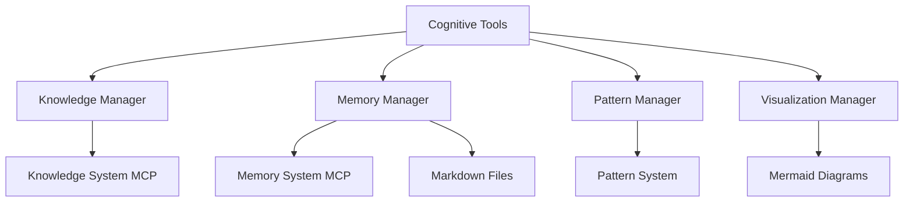

# Cognitive Tools Integration

The Cognitive Tools Integration provides a unified interface for accessing knowledge, patterns, and memory systems to enhance Cline's cognitive capabilities.

## Overview

This module integrates with various knowledge and memory systems to provide a consistent API for storing, retrieving, and manipulating knowledge, patterns, and memories. It also includes visualization tools for generating diagrams and graphs.

## Architecture

The Cognitive Tools Integration is built with a modular architecture:



## Core Components

### Knowledge Manager

The Knowledge Manager provides access to the Knowledge System MCP for storing and retrieving knowledge.

### Memory Manager

The Memory Manager provides access to the Memory System MCP for storing and retrieving memories, and for synchronizing with markdown files.

### Pattern Manager

The Pattern Manager provides tools for detecting, optimizing, and managing patterns.

### Visualization Manager

The Visualization Manager provides tools for generating visualizations of knowledge, patterns, and memories.

## Usage

### Installation

No installation is required as the Cognitive Tools Integration is part of the core system.

### Initialization

```typescript
import cognitiveTools from './cognitive-tools/api';

// Initialize the Cognitive Tools
await cognitiveTools.initialize();
```

### Knowledge API

```typescript
// Store knowledge
const knowledgeId = await cognitiveTools.knowledge.store({
  content: 'The Memory Bank is a structured documentation system...',
  type: KnowledgeType.CONCEPT,
  metadata: {
    title: 'Memory Bank Concept',
    description: 'Core concept of the Memory Bank system',
    tags: ['memory-bank', 'documentation', 'context'],
    importance: ImportanceLevel.HIGH
  }
});

// Get knowledge by ID
const knowledge = await cognitiveTools.knowledge.getById(knowledgeId);

// Search knowledge
const searchResults = await cognitiveTools.knowledge.search('memory bank');
```

### Memory API

```typescript
// Store memory
const memoryId = await cognitiveTools.memory.store({
  content: 'Implemented the Memory Bank system...',
  type: MemoryType.MILESTONE,
  metadata: {
    title: 'Memory Bank Implementation',
    description: 'Implementation milestone for the Memory Bank system',
    tags: ['memory-bank', 'implementation', 'milestone'],
    importance: ImportanceLevel.HIGH
  }
});

// Get memory by ID
const memory = await cognitiveTools.memory.getById(memoryId);

// Update memory bank
const updatedFiles = await cognitiveTools.memory.updateMemoryBank(memory);

// Sync memory bank
await cognitiveTools.memory.syncMemoryBank();
```

### Pattern API

```typescript
// Detect patterns
const detectedPatterns = await cognitiveTools.pattern.detect(content);

// Store a pattern
const patternId = await cognitiveTools.pattern.store({
  name: 'Memory Bank Hierarchy',
  description: 'The hierarchical structure of Memory Bank files',
  type: PatternType.STRUCTURAL,
  content: 'projectbrief.md → productContext.md/systemPatterns.md/techContext.md → activeContext.md → progress.md',
  examples: [
    'Memory Bank documentation follows a strict hierarchy with projectbrief.md as the root.',
    'Changes flow through the hierarchy: projectbrief → productContext/systemPatterns/techContext → activeContext → progress'
  ],
  metadata: {
    effectiveness: 0.95,
    confidence: 0.98,
    usageCount: 1,
    tags: ['memory-bank', 'documentation', 'hierarchy']
  }
});

// Optimize content with patterns
const { optimizedContent, appliedPatterns } = await cognitiveTools.pattern.optimize(
  'The Memory Bank documentation needs to be organized.',
  [await cognitiveTools.pattern.getById(patternId)]
);
```

### Visualization API

```typescript
// Generate memory bank structure visualization
const memoryBankStructure = cognitiveTools.visualization.generateMemoryBankStructure();

// Generate knowledge graph
const knowledgeGraph = cognitiveTools.visualization.generateKnowledgeGraph([knowledgeId]);

// Generate pattern relationships
const patternRelationships = cognitiveTools.visualization.generatePatternRelationships([patternId]);

// Generate memory timeline
const memoryTimeline = cognitiveTools.visualization.generateMemoryTimeline([memoryId]);
```

### Utility API

```typescript
// Get logger instance
const logger = cognitiveTools.utils.getLogger();

// Get configuration
const config = cognitiveTools.utils.getConfig();

// Update configuration
cognitiveTools.utils.updateConfig({
  visualization: {
    maxDiagramSize: 10000
  }
});

// Reset configuration
cognitiveTools.utils.resetConfig();
```

## Examples

See the [basic-usage.ts](./examples/basic-usage.ts) file for a complete example of how to use the Cognitive Tools Integration.

## Configuration

The Cognitive Tools Integration can be configured by updating the configuration object:

```typescript
cognitiveTools.utils.updateConfig({
  knowledge: {
    defaultSearchLimit: 20
  },
  memory: {
    markdownIntegration: true,
    markdownPath: './memory-bank'
  },
  pattern: {
    patternSystemEnabled: true,
    defaultConfidenceThreshold: 0.8
  },
  visualization: {
    defaultDiagramType: 'flowchart',
    maxDiagramSize: 10000
  }
});
```

## Error Handling

The Cognitive Tools Integration uses a consistent error handling approach:

```typescript
try {
  await cognitiveTools.knowledge.getById('non-existent-id');
} catch (error) {
  if (error instanceof CognitiveToolsError) {
    console.error(`Error code: ${error.code}, Message: ${error.message}`);
  } else {
    console.error('Unknown error:', error);
  }
}
