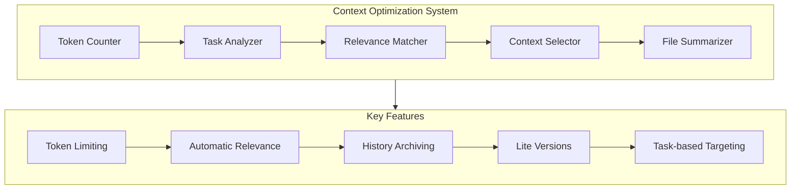

# Context Optimizer

A system for optimizing context selection for large language models (LLMs) to solve token limit issues.

## Overview

The Context Optimizer is designed to intelligently select the most relevant files for a given task while staying within token limits. It analyzes the task, extracts keywords, and finds the most relevant files based on those keywords. It also provides tools for reducing token usage through file summarization and history archiving.



## Features

- **Token Counting**: Accurate measurement of token usage across files
- **Task Analysis**: Intelligent extraction of task type and keywords
- **Relevance Matching**: Finding the most relevant files for a task
- **Context Selection**: Selecting the optimal set of files within token limits
- **File Summarization**: Creating lite versions of files to reduce token usage
- **History Archiving**: Moving historical content to archive files
- **CLI Interface**: Easy-to-use command-line interface
- **Configurable Options**: Customizable token limits and file selection

## Installation

No installation is required. The system is designed to work with the existing Memory Bank structure.

## Usage

### CLI

The Context Optimizer provides a command-line interface for easy usage:

```bash
# Optimize context for a task
node src/context-optimizer/cli.js optimize "Implement knowledge-project integration for the cognitive tools system" --max-tokens 50000

# Prepare Memory Bank for optimal context usage
node src/context-optimizer/cli.js prepare --verbose

# Get token usage statistics
node src/context-optimizer/cli.js stats --verbose

# Create a lite version of a specific file
node src/context-optimizer/cli.js create-lite activeContext.md --verbose

# Archive history from activeContext.md
node src/context-optimizer/cli.js archive-history --verbose

# Show help
node src/context-optimizer/cli.js help
```

### API

The Context Optimizer can also be used programmatically:

```javascript
const {
  optimizeContext,
  prepareMemoryBank,
  getTokenUsageStats
} = require('./index');

// Optimize context for a task
const result = await optimizeContext("Implement knowledge-project integration", {
  maxTokens: 50000,
  useLiteVersions: true,
  verbose: true
});

// Prepare Memory Bank for optimal context usage
const prepResult = await prepareMemoryBank({ verbose: true });

// Get token usage statistics
const stats = await getTokenUsageStats(true);
```

## Components

### Token Counter

The Token Counter is responsible for counting tokens in text and files. It uses the OpenAI tokenizer to accurately count tokens.

```javascript
const { countTokens, countFileTokens } = require('./token-counter');

// Count tokens in text
const tokens = countTokens("Hello, world!");

// Count tokens in a file
const fileTokens = await countFileTokens("path/to/file.md");
```

### Task Analyzer

The Task Analyzer is responsible for analyzing tasks and extracting keywords. It determines the task type and extracts relevant keywords.

```javascript
const { analyzeTask } = require('./task-analyzer');

// Analyze a task
const taskAnalysis = analyzeTask("Implement knowledge-project integration");
// { taskType: 'implementation', keywords: ['implement', 'knowledge-project', 'integration'] }
```

### Relevance Matcher

The Relevance Matcher is responsible for finding the most relevant files for a task based on keywords.

```javascript
const { findRelevantFiles } = require('./relevance-matcher');

// Find relevant files for a task
const relevantFiles = await findRelevantFiles(taskAnalysis, "path/to/directory");
```

### Context Selector

The Context Selector is responsible for selecting the optimal set of files for a task while staying within token limits.

```javascript
const { selectContext } = require('./context-selector');

// Select context for a task
const context = await selectContext(taskAnalysis, relevantFiles, { maxTokens: 50000 });
```

### File Summarizer

The File Summarizer is responsible for creating lite versions of files to reduce token usage.

```javascript
const { createLiteVersion } = require('./file-summarizer');

// Create a lite version of a file
const liteVersion = await createLiteVersion("path/to/file.md");
```

## Performance

The Context Optimizer has been shown to significantly reduce token usage:

- Token reduction in activeContext.md: ~37% (7,858 → 4,931 tokens)
- Token reduction in progress.md: ~31% (7,408 → 5,125 tokens)
- Overall token reduction: ~12% (24,991 → 22,064 tokens)

## Demo

A demo script is provided to showcase the system's capabilities:

```bash
node src/context-optimizer/demo.js
```

The demo script demonstrates the following:

1. Getting token usage statistics
2. Preparing the Memory Bank for optimal context usage
3. Getting updated token usage statistics
4. Optimizing context for different tasks

## License

This project is licensed under the MIT License.
