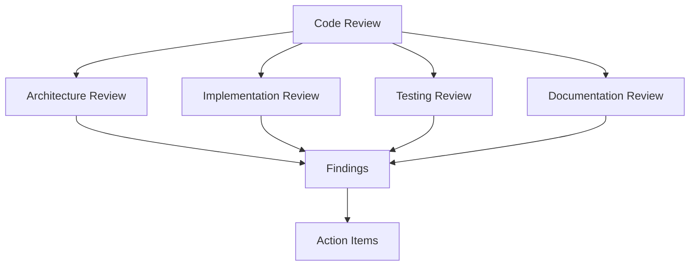

# Code Review Plan

## Overview
Pre-Phase 2 code review to ensure clean, optimized codebase before analytics implementation.

## Review Structure


## Day 1: Architecture & Patterns

### 1. Core Architecture Review
- [ ] Learning system architecture
- [ ] Pattern detection system
- [ ] Workflow analysis system
- [ ] Integration points
- [ ] Error handling patterns

### 2. Interface Review
- [ ] Type definitions
- [ ] Service interfaces
- [ ] API contracts
- [ ] Error types
- [ ] Event handling

### 3. Pattern Consistency
- [ ] Design patterns usage
- [ ] Error handling patterns
- [ ] Async patterns
- [ ] Validation patterns
- [ ] Testing patterns

## Day 2: Implementation Review

### 1. Learning System
```typescript
// Key files to review:
- src/types/learning.ts
- src/services/learning.service.ts
- src/test/learning.test.ts
```

#### Focus Areas
- [ ] Type safety
- [ ] Error handling
- [ ] Performance optimization
- [ ] Memory management
- [ ] Resource cleanup

### 2. Knowledge Graph
```typescript
// Key files to review:
- src/types/knowledge.ts
- src/services/knowledge-graph.service.ts
- src/utils/graph-analysis.ts
```

#### Focus Areas
- [ ] Graph operations
- [ ] Pattern detection
- [ ] Relationship management
- [ ] Query optimization
- [ ] Cache usage

### 3. File Operations
```typescript
// Key files to review:
- src/types/files.ts
- src/services/file-operations.service.ts
- src/utils/lock-manager.ts
- src/utils/backup-manager.ts
```

#### Focus Areas
- [ ] File safety
- [ ] Concurrency handling
- [ ] Backup management
- [ ] Error recovery
- [ ] Resource cleanup

## Day 3: Testing & Validation

### 1. Test Coverage Review
- [ ] Unit test coverage
- [ ] Integration test coverage
- [ ] Performance test coverage
- [ ] Error handling tests
- [ ] Edge case coverage

### 2. Test Quality
- [ ] Test organization
- [ ] Test patterns
- [ ] Mock usage
- [ ] Assertion quality
- [ ] Test maintainability

### 3. Validation System
```typescript
// Key files to review:
- src/types/validation.ts
- src/utils/content-validator.ts
- src/utils/path-validator.ts
- src/utils/metadata-validator.ts
```

#### Focus Areas
- [ ] Validation completeness
- [ ] Error handling
- [ ] Performance impact
- [ ] Edge cases
- [ ] Integration points

## Day 4: Documentation & Cleanup

### 1. Code Documentation
- [ ] Type documentation
- [ ] Function documentation
- [ ] Interface documentation
- [ ] Error documentation
- [ ] Example usage

### 2. System Documentation
- [ ] Architecture documentation
- [ ] API documentation
- [ ] Integration documentation
- [ ] Error handling documentation
- [ ] Testing documentation

### 3. Implementation Cleanup
- [ ] Code organization
- [ ] Naming conventions
- [ ] Error handling
- [ ] Performance optimization
- [ ] Resource management

## Review Checklist

### Architecture
- [ ] Clean architecture principles
- [ ] SOLID principles
- [ ] Design pattern consistency
- [ ] Error handling strategy
- [ ] Performance considerations

### Implementation
- [ ] Type safety
- [ ] Error handling
- [ ] Resource management
- [ ] Performance optimization
- [ ] Code organization

### Testing
- [ ] Test coverage
- [ ] Test quality
- [ ] Mock usage
- [ ] Edge cases
- [ ] Performance tests

### Documentation
- [ ] Code comments
- [ ] API documentation
- [ ] System documentation
- [ ] Example usage
- [ ] Error documentation

## Action Items Template

### High Priority
```typescript
interface ActionItem {
    description: string;
    impact: 'high' | 'medium' | 'low';
    effort: 'small' | 'medium' | 'large';
    area: 'architecture' | 'implementation' | 'testing' | 'documentation';
    file?: string;
    notes?: string;
}
```

### Example
```typescript
const actionItems: ActionItem[] = [
    {
        description: "Implement consistent error handling in learning service",
        impact: "high",
        effort: "medium",
        area: "implementation",
        file: "src/services/learning.service.ts",
        notes: "Currently mixing error types, need standardization"
    }
];
```

## Review Process

### 1. Initial Review
1. Architecture assessment
2. Pattern identification
3. Issue documentation
4. Priority assignment
5. Effort estimation

### 2. Team Review
1. Findings presentation
2. Discussion
3. Priority alignment
4. Action item agreement
5. Timeline establishment

### 3. Implementation
1. High priority fixes
2. Pattern alignment
3. Test updates
4. Documentation updates
5. Final validation

### 4. Validation
1. Code review
2. Test execution
3. Performance validation
4. Documentation review
5. Final approval

## Success Metrics

### Code Quality
- Type safety: 100%
- Test coverage: >90%
- Documentation: 100%
- Error handling: 100%
- Performance: Within specs

### Process Metrics
- Review completion: 4 days
- Action items identified
- Priorities assigned
- Timeline established
- Team alignment

## Next Steps

### 1. Immediate Actions
1. Schedule architecture review
2. Prepare review materials
3. Set up review environment
4. Gather metrics
5. Document findings

### 2. Follow-up
1. Track action items
2. Monitor progress
3. Validate changes
4. Update documentation
5. Final review
