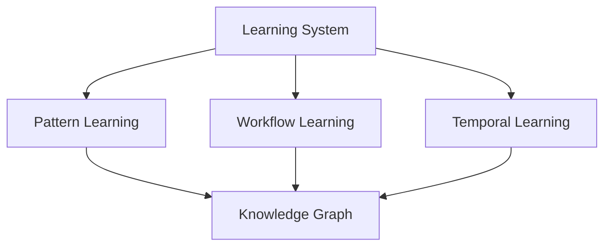
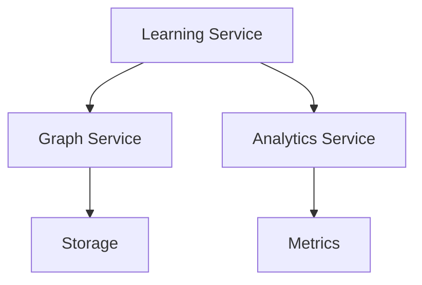
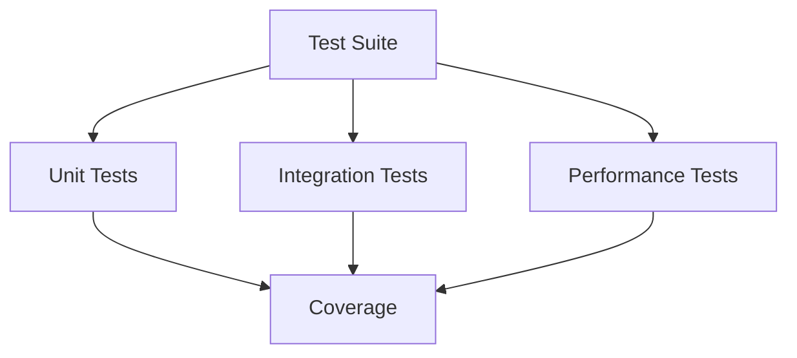
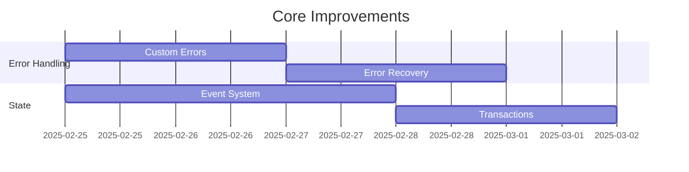
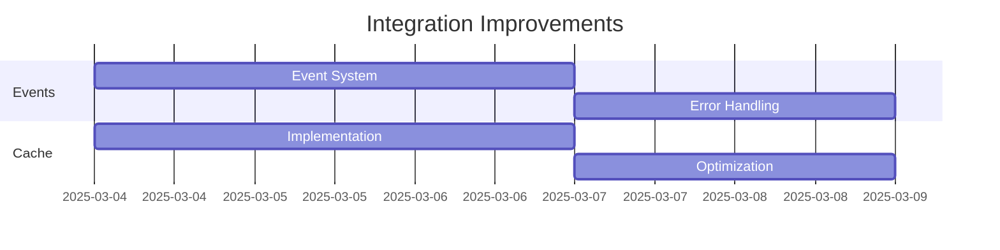
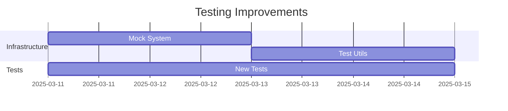

# Code Review Summary

## Overview
Comprehensive review of the learning system implementation, focusing on architecture, integration, and testing.

## Key Findings

### 1. Architecture

#### Strengths
- Clean interface design
- Strong type safety
- Clear separation of concerns
- Consistent patterns

#### Areas for Improvement
- Error handling standardization
- Metrics implementation
- Validation strategy
- State management
- Transaction support

### 2. Integration

#### Strengths
- Pattern analysis
- Learning integration
- Workflow analysis
- Graph operations

#### Areas for Improvement
- Event-driven updates
- Batch processing
- Performance optimization
- Caching strategy
- Error propagation

### 3. Testing

#### Strengths
- Test organization
- Test setup
- Assertion patterns
- Coverage structure

#### Areas for Improvement
- Mock integration
- Edge case coverage
- Performance testing
- Concurrency testing
- Validation testing

## Action Items

### 1. High Priority
1. Error Handling
   - Implement custom error types
   - Add error propagation
   - Enhance error recovery
   - Add error logging
   - Update error documentation

2. State Management
   - Implement event system
   - Add transaction support
   - Add state validation
   - Enhance consistency
   - Add rollback support

3. Testing Infrastructure
   - Set up mock system
   - Add validation utilities
   - Enhance test coverage
   - Add performance tests
   - Add concurrency tests

### 2. Medium Priority
1. Performance Optimization
   - Implement caching
   - Add batch processing
   - Optimize queries
   - Add monitoring
   - Add benchmarks

2. Integration Enhancement
   - Add event system
   - Enhance error handling
   - Add metrics tracking
   - Improve consistency
   - Add validation

3. Documentation Updates
   - Update architecture docs
   - Add pattern guides
   - Update test docs
   - Add examples
   - Update API docs

### 3. Low Priority
1. Developer Experience
   - Add development tools
   - Enhance debugging
   - Add documentation
   - Add examples
   - Add tutorials

2. Monitoring
   - Add metrics
   - Add logging
   - Add tracing
   - Add alerts
   - Add dashboards

3. Security
   - Add validation
   - Add sanitization
   - Add authorization
   - Add audit logs
   - Add security tests

## Implementation Timeline

### Phase 1: Core Improvements (Days 1-5)

### Phase 2: Integration (Days 6-10)

### Phase 3: Testing (Days 11-14)

## Success Metrics

### 1. Code Quality
- Test coverage: >90%
- Error handling: 100%
- Type safety: 100%
- Documentation: 100%
- Performance: Within specs

### 2. System Health
- Error rate: <0.1%
- Response time: <100ms
- Cache hit rate: >90%
- Memory usage: <512MB
- CPU usage: <50%

### 3. Developer Experience
- Build time: <2min
- Test time: <5min
- Documentation: Complete
- Examples: Available
- Tools: Functional

## Next Steps

### 1. Immediate Actions
1. Create error types
2. Implement event system
3. Add transaction support
4. Set up test infrastructure
5. Update documentation

### 2. Team Tasks
1. Review findings
2. Assign priorities
3. Create tickets
4. Schedule work
5. Plan reviews

### 3. Follow-up
1. Weekly reviews
2. Progress tracking
3. Metric monitoring
4. Documentation updates
5. Team feedback

## Conclusion
The learning system provides a solid foundation with well-designed interfaces and clear patterns. The recommended improvements will enhance reliability, performance, and maintainability while ensuring a better developer experience.
