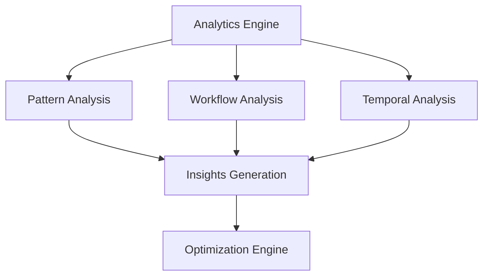
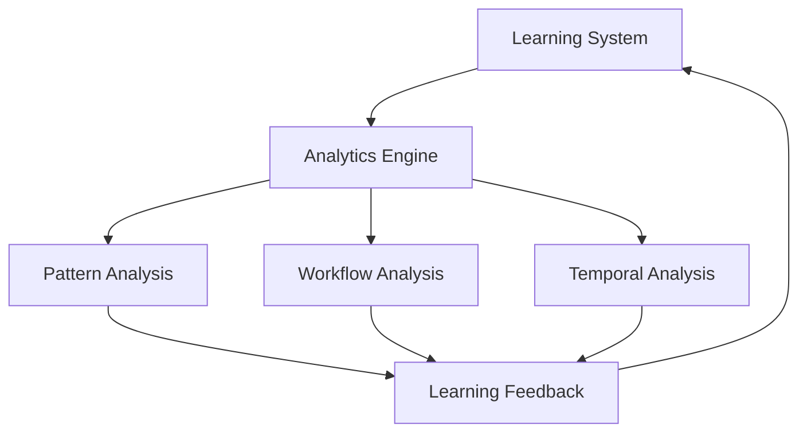

# Phase 2: Advanced Analytics Implementation Plan

## Overview
Building upon the core learning system completed in Phase 1, Phase 2 focuses on implementing advanced analytics capabilities to enhance pattern recognition, workflow optimization, and predictive capabilities.

## System Architecture


## Components

### 1. Analytics Engine
```typescript
interface AnalyticsEngine {
    analyzePatterns(data: PatternData[]): Promise<PatternAnalysis>;
    analyzeWorkflow(workflow: WorkflowData): Promise<WorkflowAnalysis>;
    analyzeTemporalData(sequence: TemporalData[]): Promise<TemporalAnalysis>;
    generateInsights(analyses: Analysis[]): Promise<Insights>;
}
```

### 2. Pattern Analysis
- Enhanced pattern detection
- Pattern correlation analysis
- Pattern evolution tracking
- Impact assessment
- Confidence scoring

### 3. Workflow Analysis
- Workflow efficiency metrics
- Resource utilization tracking
- Bottleneck detection
- Optimization opportunities
- Performance prediction

### 4. Temporal Analysis
- Sequence optimization
- Timing analysis
- Dependency mapping
- Critical path identification
- Resource allocation

## Integration Points

### 1. Learning System Integration


### 2. Knowledge Graph Integration
- Pattern relationship mapping
- Workflow dependency tracking
- Temporal sequence visualization
- Resource allocation optimization
- Performance metrics tracking

### 3. System Monitoring Integration
- Real-time analytics
- Performance tracking
- Resource utilization
- Error detection
- Optimization feedback

## Implementation Steps

### 1. Analytics Engine (Days 1-3)
1. Set up analytics engine structure
2. Implement core analysis methods
3. Add data processing capabilities
4. Create analysis pipeline
5. Implement caching system

### 2. Analysis Components (Days 4-7)
1. Build pattern analysis system
2. Implement workflow analysis
3. Create temporal analysis
4. Add correlation detection
5. Implement prediction system

### 3. Integration Layer (Days 8-10)
1. Connect with learning system
2. Integrate with knowledge graph
3. Add monitoring hooks
4. Implement feedback loop
5. Create visualization system

### 4. Testing & Validation (Days 11-14)
1. Unit test coverage
2. Integration testing
3. Performance testing
4. System validation
5. Documentation updates

## Dependencies

### Required Components
1. Learning system (✅ Completed)
2. Knowledge graph (✅ Completed)
3. Monitoring system (✅ Completed)
4. Visualization system (✅ Completed)

### Technical Requirements
1. TypeScript 4.x+
2. Node.js 18.x+
3. Testing framework
4. Performance monitoring
5. Visualization libraries

## Test Coverage Requirements

### 1. Unit Tests
- Analytics engine core functionality
- Analysis component methods
- Data processing utilities
- Integration adapters
- Utility functions

### 2. Integration Tests
- Learning system integration
- Knowledge graph integration
- Monitoring system integration
- Visualization system integration
- End-to-end workflows

### 3. Performance Tests
- Analysis engine performance
- Data processing efficiency
- Memory utilization
- CPU utilization
- Response times

## Risk Assessment

### Technical Risks
1. Performance impact on existing systems
2. Data processing scalability
3. Memory management
4. Integration complexity
5. System stability

### Mitigation Strategies
1. Performance monitoring
2. Incremental deployment
3. Fallback mechanisms
4. Extensive testing
5. Documentation maintenance

## Success Metrics

### Performance Metrics
- Analysis speed: < 100ms
- Memory usage: < 512MB
- CPU usage: < 50%
- Response time: < 200ms
- Cache hit rate: > 90%

### Quality Metrics
- Test coverage: > 90%
- Code quality: > 90%
- Documentation: 100%
- Error rate: < 0.1%
- User satisfaction: > 90%

## Next Steps

### Immediate Actions
1. Set up analytics engine structure
2. Create core interfaces
3. Implement basic analysis
4. Add test framework
5. Update documentation

### Preparation Tasks
1. Review existing codebase
2. Set up development environment
3. Create test data
4. Configure monitoring
5. Update dependencies
