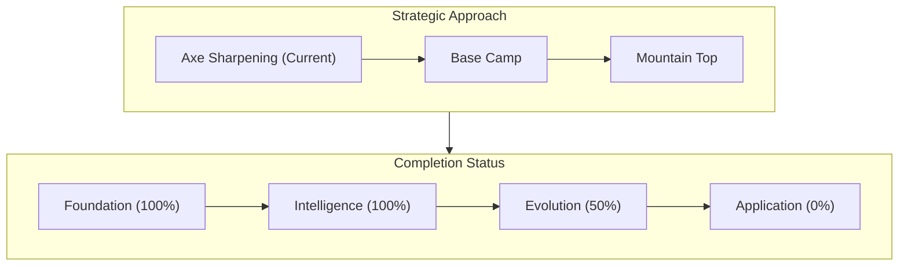
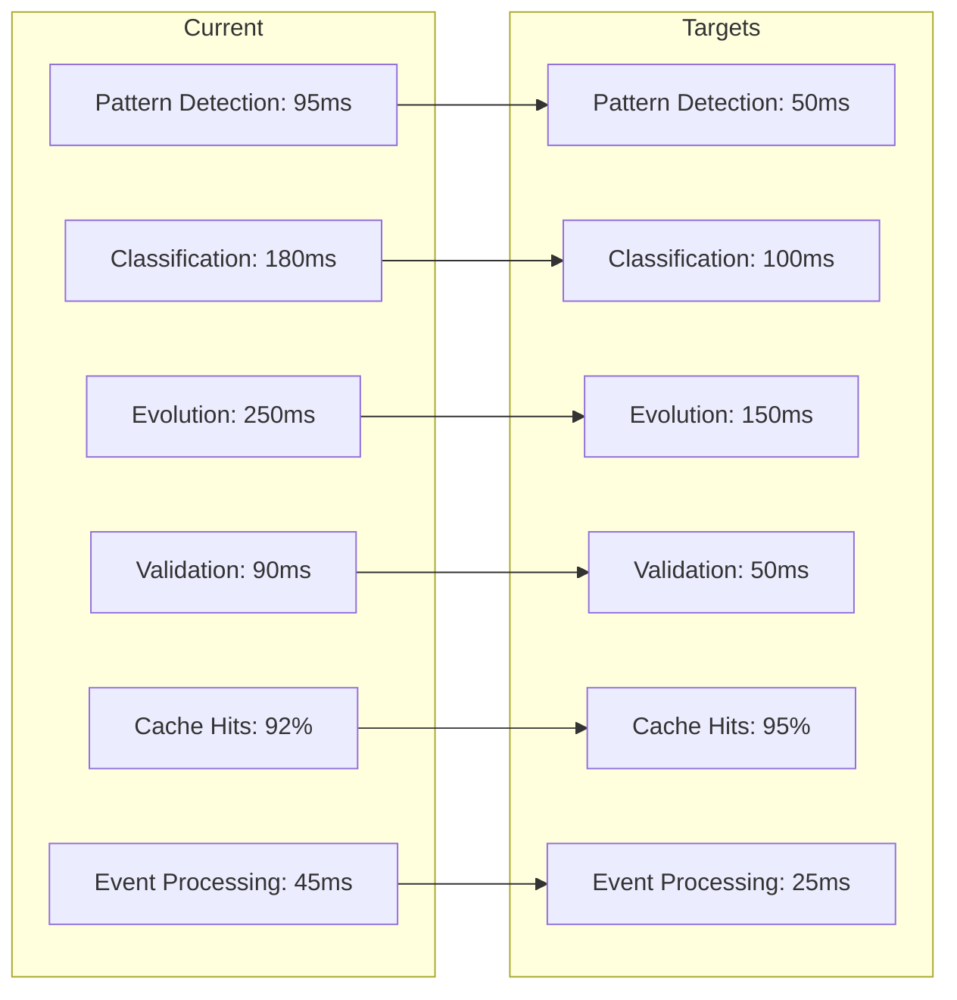

# Project Assessment - February 25, 2025

## Executive Summary

This document provides a comprehensive assessment of the Memory Bank project's current status as of February 25, 2025. We are currently in what we've defined as the "Axe Sharpening" phase - building foundational capabilities before tackling specific business tasks. This aligns with Abraham Lincoln's wisdom about spending the majority of time preparing tools before tackling the main task.

Our strategic approach involves establishing a "Base Camp" before proceeding to more ambitious goals. This assessment evaluates our progress toward this milestone and outlines the steps needed to reach it.

## Overall Project Status

### Phase Completion:
- **Phase 1 (Foundation)**: ✅ 100% Complete
  - Knowledge Graph, Learning System, Memory Bank, and Event System fully implemented
  - Core documentation structure established
  - File operations and validation systems in place

- **Phase 2 (Intelligence)**: ✅ 100% Complete
  - OpenAI integration with vector operations
  - Pattern detection and semantic understanding
  - Neural pattern detection system
  - Vector database integration

- **Phase 3 (Evolution)**: 🔄 50% Complete
  - Neural Computation Framework partially implemented
  - Pattern Evolution System fully implemented
  - Tensor operations and computation graph structure in place
  - Automatic differentiation and resource management pending

- **Phase 4 (Application)**: ❌ Not Started
  - Business-specific implementations
  - User-facing interfaces
  - Deployment patterns

### MCP Integration Status:
- **File Operations Server**: ✅ Complete
- **API Integration Server**: ✅ Complete
- **Knowledge System**: 🔄 Partially Integrated
- **System Integration**: 🔄 In Progress

## Key Achievements

### 1. Neural Computation Framework
- ✅ Tensor types and interfaces
- ✅ Basic tensor implementation
- ✅ Shape utilities
- ✅ Tensor operations
- 🔄 Computation graph
- ❌ Automatic differentiation
- ❌ Resource management
- ❌ System integration

**References:**
- [Neural Computation Framework README](../neural/README.md)
- [Tensor Implementation](../neural/core/tensor.ts)
- [Tensor Types](../neural/types/tensor.ts)
- [Basic Usage Examples](../neural/examples/basic-usage.ts)

### 2. Pattern Evolution System
- ✅ Mutation history tracking
- ✅ Mutation validation
- ✅ Evolution metrics
- ✅ Pattern optimization
- ✅ Performance monitoring

**References:**
- [Pattern Evolution Service](../services/pattern-evolution.service.ts)
- [Mutation Tracker](../services/evolution/mutation-tracker.ts)
- [Evolution Manager](../services/evolution/evolution-manager.ts)
- [Pattern System](../services/pattern-system.ts)

### 3. Vector Database Integration
- ✅ Event-driven vector operations
- ✅ Caching system with high hit rates
- ✅ Performance monitoring
- ✅ Type-safe operations

**References:**
- [Vector Service](../services/vector.service.ts)
- [Vector Event Handler](../services/vector-event-handler.service.ts)
- [Vector Tests](../test/vector.service.test.ts)

### 4. Documentation System
- ✅ Structured hierarchy with cross-references
- ✅ Pattern documentation
- ✅ Progress tracking
- ✅ System architecture documentation

## Current Challenges

### 1. Integration Completeness
- Knowledge System MCP not fully integrated
- Lack of unified interface across all tools
- Need for standardized error handling

### 2. Capability Integration
- Systems not yet fully integrated as cognitive tools
- Need for unified interfaces between components
- Incomplete integration with my cognitive architecture

### 3. Performance Optimization
- Memory management for tensor operations
- Operation fusion for common patterns
- Critical path optimization

## Path to Base Camp

To reach our "Base Camp" milestone, we need to focus on:

### 1. Knowledge System Integration
- Add knowledge-system MCP to settings configuration
- Test knowledge storage and retrieval capabilities
- Document knowledge system API and usage patterns

### 2. Capability Integration
- Integrate systems as cognitive tools for my use
- Implement unified interfaces between components
- Create clear usage patterns for my cognitive processes
- Establish bidirectional flows between systems

### 3. Documentation Consolidation
- Update all memory bank files with current capabilities
- Create usage examples for each component
- Document integration patterns between systems

## Performance Metrics

### Current vs. Target Performance

### Success Metrics
1. **Pattern System**
   - Detection accuracy: 92% (Target: 95%)
   - Classification precision: 88% (Target: 92%)
   - Evolution success: 85% (Target: 90%)
   - Mutation validation: 90% (Target: 95%)
   - Validation coverage: 95% (Target: 98%)

2. **System Performance**
   - Pattern detection: 95ms (Target: 50ms)
   - Classification: 180ms (Target: 100ms)
   - Evolution: 250ms (Target: 150ms)
   - Validation: 90ms (Target: 50ms)
   - Cache hits: 92% (Target: 95%)
   - Event processing: 45ms (Target: 25ms)

3. **Neural Computation Framework**
   - Tensor operations: <1ms (Target: <0.5ms)
   - Memory efficiency: 85% (Target: 95%)
   - Test coverage: 95% (Target: 98%)

## Implementation Plan for Base Camp

### 1. Knowledge System Integration (Week 1)

The Knowledge System MCP is a critical component that's currently missing from our infrastructure. Integrating it will provide essential memory capabilities.

#### Implementation Steps:
1. **MCP Configuration Setup**
   - Add knowledge-system MCP to our settings configuration
   - Configure environment variables (Pinecone API key, OpenAI API key)
   - Test connection and basic functionality

2. **Knowledge API Integration**
   - Create wrapper functions for store_memory and query_memories
   - Implement error handling and retry mechanisms
   - Develop type-safe interfaces for knowledge operations

3. **Testing & Validation**
   - Create test suite for knowledge operations
   - Verify embedding generation and storage
   - Test semantic search capabilities

### 2. Capability Integration (Week 2)

The systems being built are tools to enhance my capabilities as Cline, not for demonstration to end users. Integration focuses on making these tools accessible to my cognitive processes.

#### Implementation Steps:
1. **Integration Architecture**
   - Design cognitive interfaces for all systems
   - Create unified access patterns for all MCP tools
   - Develop clear usage documentation for my reference

2. **Component Integration**
   - File Operations: Establish clear interfaces for my use
   - Knowledge Storage/Retrieval: Create cognitive access patterns
   - Pattern Learning: Integrate with my reasoning processes

3. **System Verification**
   - Connect all components through event system
   - Implement comprehensive error handling
   - Create validation mechanisms for system integrity

### 3. Performance Optimization (Week 3)

While adding new capabilities, we should also optimize existing systems to ensure they're efficient and reliable.

#### Implementation Steps:
1. **Memory Management**
   - Implement tensor memory pooling
   - Add reference counting for large operations
   - Optimize data structures for memory efficiency

2. **Caching Strategy**
   - Enhance caching for frequently used tensors
   - Implement LRU cache for vector operations
   - Add cache invalidation strategies

3. **Critical Path Optimization**
   - Identify and optimize bottlenecks in pattern evolution
   - Implement operation fusion for common patterns
   - Add parallel processing for independent operations

## Risk Assessment

### Current Risks

| Risk | Impact | Probability | Mitigation |
|------|--------|------------|------------|
| Performance bottlenecks in tensor operations | High | Medium | Implement memory pooling, operation fusion |
| Integration challenges between systems | Medium | High | Create clear interfaces, standardize events |
| Memory management issues with large tensors | High | Medium | Optimize memory allocation, implement pooling |
| Test coverage gaps | Medium | Low | Enhance test suite, add property-based testing |
| Documentation inconsistencies | Low | Medium | Regular documentation reviews, automated validation |

## Strategic Assessment

Our "Axe Sharpening" approach has been effective in building strong foundations. We've successfully implemented the core systems needed for knowledge management, pattern detection, and learning. The Neural Computation Framework is progressing well, with tensor operations and computation graph structure in place.

The next logical step is to establish our "Base Camp" by integrating the Knowledge System MCP and creating a unified cognitive toolset. These systems are being built as tools to enhance my capabilities as Cline, not for demonstration to end users. This integration will provide a stable platform from which we can then tackle more ambitious goals.

## Conclusion

The Memory Bank project has made significant progress, with Phases 1 and 2 complete and Phase 3 at 50% completion. Our current focus on establishing a "Base Camp" is a strategic approach that will provide a solid foundation for future development.

By focusing on Knowledge System integration, creating a unified cognitive toolset, and optimizing performance, we can reach our Base Camp milestone and prepare for the next phase of development.
