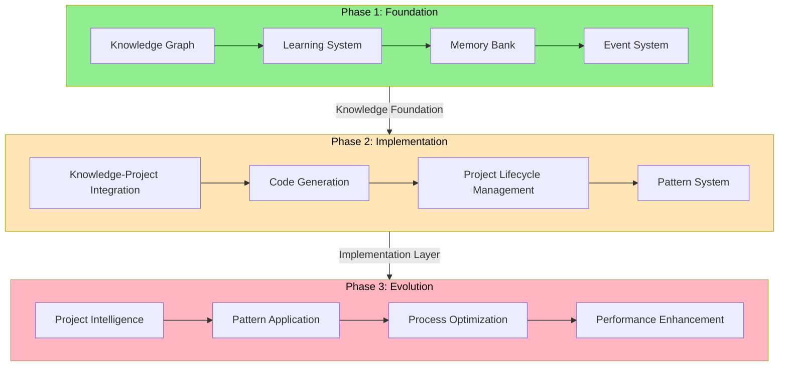
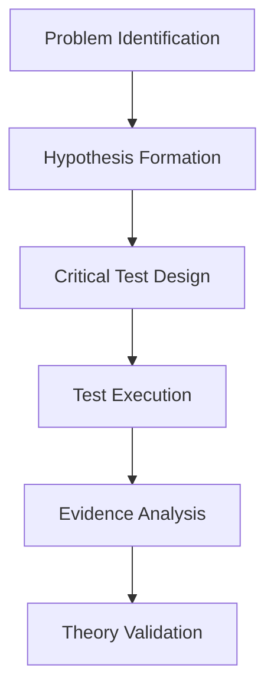
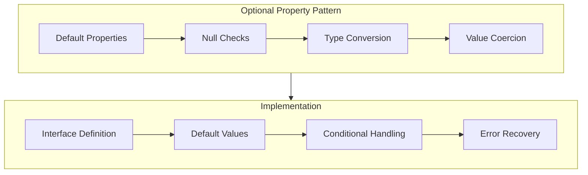
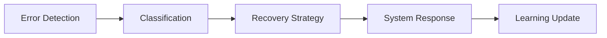
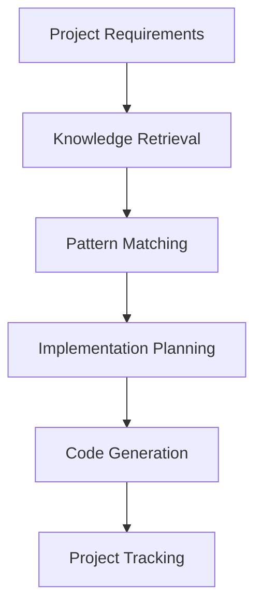
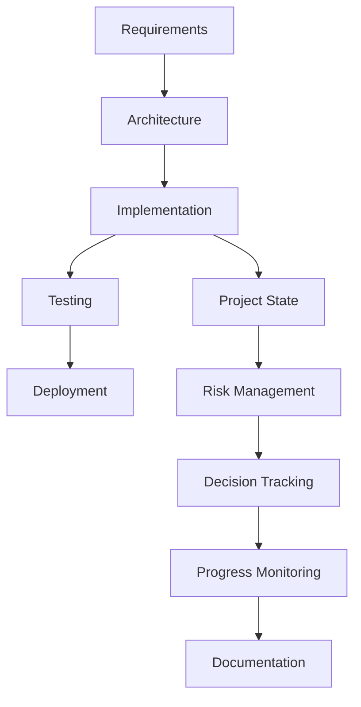
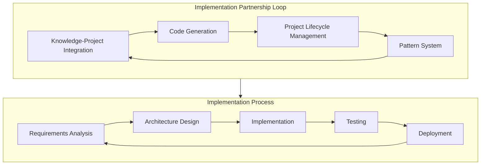

# System Architecture Patterns

## Vision & Design Philosophy

Our system follows a three-phase evolutionary architecture, where each phase builds upon the previous one to create an increasingly effective implementation partner capable of translating ideas into code and managing projects.



## Core System Patterns

### 1. Foundation Layer (Phase 1) ✅
- **Knowledge Graph**
  - Project-specific knowledge representation
  - Relationship mapping between requirements, architecture, and implementation
  - Implementation pattern detection
  - Project event tracking

- **Learning System**
  - Implementation pattern learning
  - Project workflow optimization
  - Code quality analysis
  - Implementation efficiency improvements

- **Memory Bank**
  - Project documentation management
  - Implementation knowledge persistence
  - Cross-referencing between project artifacts
  - Implementation pattern documentation

- **Event System**
  - Project state change tracking
  - Implementation milestone events
  - Pattern detection and application events
  - Project monitoring

### 2. Implementation Layer (Phase 2) 🔄
- **Knowledge-Project Integration**
  ```mermaid
  flowchart LR
      A[Project Requirements] --> B[Knowledge System]
      B --> C[Project Context]
      C --> D[Implementation Plan]
      D --> E[Code Generation]
      E --> F[Project Artifacts]
  ```
  - Project context preservation
  - Implementation knowledge retrieval
  - Pattern-based implementation planning
  - Project decision tracking

- **Code Generation**
  - Pattern-based code generation
  - Implementation template application
  - Code validation and optimization
  - Refactoring capabilities
  - Type-safe operations
  - Comprehensive validation

- **Project Lifecycle Management**
  - Requirements management
  - Architecture design
  - Implementation tracking
  - Testing coordination
  - Deployment management

### 3. Evolution Layer (Phase 3) ⏳
- **Project Intelligence**
  - Project pattern recognition
  - Implementation optimization
  - Risk detection and mitigation
  - Performance analysis

- **Implementation Evolution**
  - Automated implementation improvements
  - Context-aware code generation
  - Adaptive project management
  - Self-improving implementation capabilities

## Implementation Patterns

### 1. Critical Test Methodology ✅


- **Key Components**
  1. Environment-aware testing
  2. Resource management
  3. State validation
  4. Error handling

### 2. Optional Property Handling Pattern ✅



**Pattern Description:**
This pattern provides a systematic approach to handling optional properties in TypeScript interfaces, ensuring type safety, proper initialization, and error handling.

**Key Components:**
1. **Interface Definition**
   - Clear typing with optional properties marked with `?`
   - Documentation of default values and behavior
   - Separation of required and optional properties

2. **Default Value Initialization**
   - Explicit initialization of optional properties
   - Use of nullish coalescing operator (`??`) for defaults
   - Consistent default value patterns

3. **Null/Undefined Checks**
   - Defensive programming with null checks before operations
   - Early returns or fallbacks for missing values
   - Type guards to ensure type safety

4. **Error Handling**
   - Graceful degradation when optional properties are missing
   - Clear error messages for debugging
   - Recovery strategies for missing data

**Implementation Example:**
```typescript
interface MetricsWithOptionals {
  required: number;
  optional?: number;
  anotherOptional?: string;
}

function processMetrics(metrics: MetricsWithOptionals): number {
  // Default value initialization
  const optionalValue = metrics.optional ?? 0;

  // Null/undefined checks with type guards
  if (metrics.anotherOptional !== undefined && typeof metrics.anotherOptional === 'string') {
    // Safe to use metrics.anotherOptional as string
    console.log(`Additional info: ${metrics.anotherOptional}`);
  }

  // Error handling with try/catch
  try {
    return metrics.required + optionalValue;
  } catch (error) {
    console.error('Error processing metrics:', error);
    return metrics.required;
  }
}
```

**Application:**
- Used in Knowledge-Pattern Bridge service for handling optional metrics
- Applied in Knowledge-Project Integration for optional properties
- Implemented in Cognitive Tools for consistent API surface
- Utilized in Neural Computation Framework for optional parameters

**Benefits:**
- Improved type safety
- Reduced runtime errors
- Better developer experience
- More maintainable code
- Consistent handling of edge cases

**References:**
- [Knowledge-Pattern Bridge Service](src/services/knowledge-pattern-bridge.service.ts)
- [Knowledge-Project Integration Types](src/cognitive-tools/types/knowledge-project-integration.ts)
- [TypeScript Handbook - Advanced Types](https://www.typescriptlang.org/docs/handbook/advanced-types.html)

### 3. Resource Management
- **Lock Management**
  ```typescript
  interface LockManager {
      acquire(): Promise<void>;
      release(): Promise<void>;
      isLocked(): boolean;
  }
  ```

- **Cache System**
  ```typescript
  interface CacheManager {
      get<T>(key: string): Promise<T | null>;
      set<T>(key: string, value: T): Promise<void>;
      clear(): Promise<void>;
  }
  ```

- **Memory Pooling**
  ```mermaid
  flowchart TD
    A[Memory Request] --> B[Memory Pool]
    B --> C{Available in Pool?}
    C -->|Yes| D[Reuse Memory]
    C -->|No| E[Allocate New Memory]
    D --> F[Return to Application]
    E --> F
    G[Release Memory] --> H[Return to Pool]
  ```
  - Size-based bucketing for efficient allocation
  - TypedArray reuse with automatic zeroing
  - Memory usage tracking and statistics
  - Configurable pool sizes and growth factors
  - Support for multiple data types

- **Tensor Management**
  ```typescript
  interface TensorManager {
    createTensor(options: TensorOptions): Tensor;
    releaseTensor(tensor: Tensor): void;
    zeros(shape: Shape): Tensor;
    ones(shape: Shape): Tensor;
    random(shape: Shape): Tensor;
    fromArray(values: number[], shape?: Shape): Tensor;
  }
  ```
  - Reference counting and automatic memory management
  - Tensor lifecycle tracking
  - Performance metrics collection
  - Factory functions for common tensor operations

### 4. Error Handling


## Project Management Patterns

### 1. Knowledge-Project Integration


### 2. Code Generation


### 3. Project Lifecycle Management


## Implementation Partnership System

### Implementation Partnership Loop


1. **Knowledge-Project Integration**
   - Connect project requirements to implementation knowledge
   - Enable pattern-based implementation planning
   - Allow knowledge retrieval to guide implementation decisions
   - Create feedback loops for continuous project improvement

2. **Code Generation Capabilities**
   - Generate code based on implementation patterns
   - Apply templates for common implementation tasks
   - Validate generated code against requirements
   - Refactor and optimize implementations

3. **Project Lifecycle Management**
   - Track project progress from requirements to deployment
   - Manage implementation milestones and risks
   - Document project decisions and rationales
   - Ensure consistent implementation approach

4. **Pattern Application**
   - Apply proven implementation patterns to new projects
   - Adapt patterns based on project requirements
   - Optimize patterns for specific implementation contexts
   - Evolve patterns based on implementation results

## Performance Patterns

### 1. Implementation Efficiency
- Pattern-based code generation
- Template reuse
- Implementation optimization
- Type-safe operations

### 2. Project Management Efficiency
- Requirement tracking
- Decision documentation
- Risk management
- Progress monitoring

## Evolution Strategy

### Phase 1: Foundation ✅
- Core knowledge systems
- Event handling
- Basic learning capabilities
- Documentation management

### Phase 2: Implementation 🔄
- Knowledge-project integration
- Code generation capabilities
- Project lifecycle management
- Pattern application

### Phase 3: Evolution ⏳
- Project intelligence
- Implementation optimization
- Process streamlining
- Performance enhancement

## Success Metrics

### Implementation Efficiency
- Code generation: <100ms
- Pattern application: <150ms
- Implementation planning: <500ms
- Project updates: <50ms
- Knowledge retrieval: <50ms
- Event processing: <25ms
- Template application: <5ms

### Project Management Effectiveness
- Requirement tracking: 100%
- Decision documentation: 100%
- Risk management: >90%
- Progress monitoring: 100%
- Implementation validation: >95%
