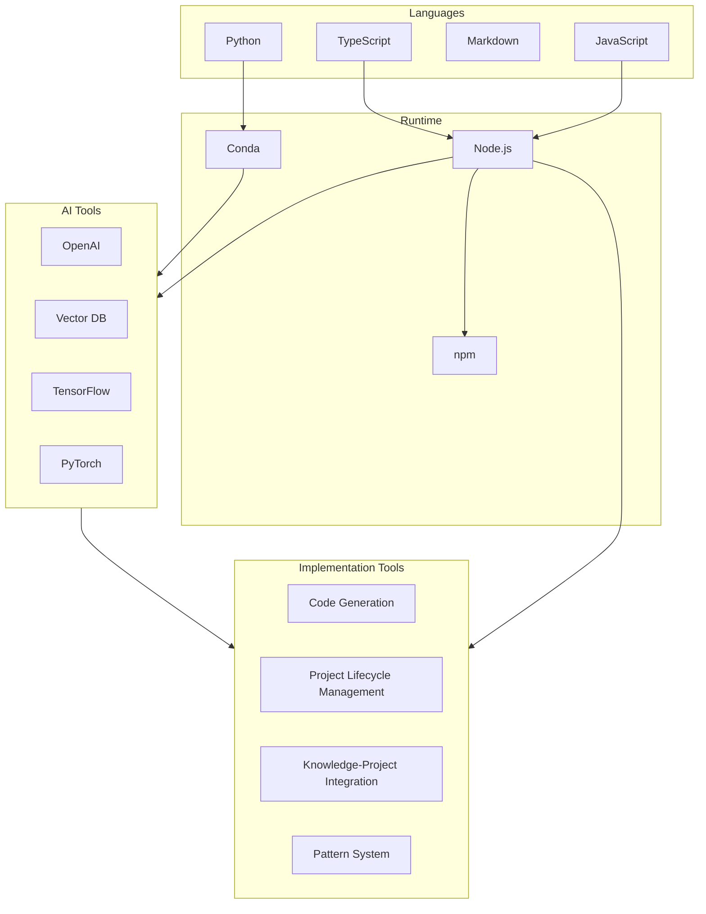
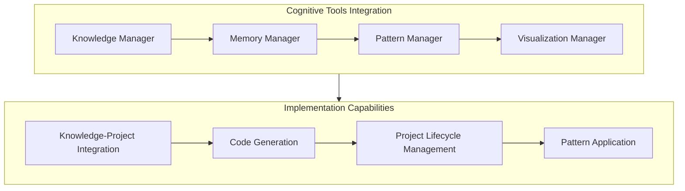

# Technical Context

## Technology Stack for Implementation Partnership

### Core Technologies


### Development Environment

1. **Required Software**
   - Node.js v18+
   - npm v9+
   - Git v2.3+
   - VSCode with extensions:
     - ESLint
     - Prettier
     - Markdown All in One
     - Mermaid Preview

2. **Project Structure**
   ```
   memory-bank/
   ├── docs/                # Documentation files
   ├── src/                 # Source code
   │   ├── cognitive-tools/ # Implementation partnership tools
   │   ├── services/        # Core services
   │   ├── types/           # TypeScript types
   │   └── utils/           # Utilities
   ├── tests/               # Test files
   └── scripts/             # Build/maintenance scripts
   ```

## Dependencies

### Production Dependencies
```json
{
  "dependencies": {
    "uuid": "^9.0.0",
    "fs-extra": "^11.0.0",
    "markdown-it": "^13.0.0",
    "mermaid": "^10.0.0",
    "chokidar": "^3.5.0",
    "eventemitter3": "^5.0.0",
    "openai": "^4.0.0",
    "@pinecone-database/pinecone": "^1.0.0",
    "@tensorflow/tfjs-node": "^4.0.0",
    "onnxruntime-node": "^1.0.0",
    "transformers": "^4.0.0"
  }
}
```

### Development Dependencies
```json
{
  "devDependencies": {
    "typescript": "^5.0.0",
    "jest": "^29.0.0",
    "ts-jest": "^29.0.0",
    "eslint": "^8.0.0",
    "prettier": "^3.0.0",
    "@types/node": "^18.0.0",
    "@types/tensorflow__tfjs-node": "^4.0.0",
    "@types/onnxruntime-node": "^1.0.0",
    "@types/transformers": "^4.0.0"
  }
}
```

## Technical Requirements for Implementation Partnership

### System Requirements
- Memory: 16GB+ RAM (for handling complex implementation tasks)
- Storage: 10GB+ free space (for project files and code generation)
- CPU: 4+ cores with AVX2 support (for efficient code generation)
- GPU: CUDA-compatible (optional, for neural pattern detection)
- OS: Windows/macOS/Linux

### Network Requirements
- Local file system access (for project management)
- Git repository access (for version control)
- OpenAI API access (for code generation and pattern detection)
- Pinecone API access (for knowledge storage and retrieval)
- Model registry access (for implementation patterns)
- npm registry access (for dependencies)

## Development Setup

### Installation
```bash
# Clone repository
git clone https://github.com/user/memory-bank.git

# Install dependencies
npm install

# Build project
npm run build

# Run tests
npm test
```

### Configuration
```typescript
// config/default.ts
export default {
  docs: {
    path: './docs',
    extensions: ['.md'],
    watchEnabled: true
  },
  implementation: {
    codeGeneration: {
      enabled: true,
      templates: './templates',
      patterns: './patterns',
      validation: true
    },
    projectManagement: {
      tracking: true,
      milestones: true,
      risks: true,
      decisions: true
    }
  },
  validation: {
    enabled: true,
    autoFix: false,
    strict: false
  },
  events: {
    queueSize: 1000,
    retryAttempts: 3,
    retryDelay: 1000
  },
  ai: {
    openai: {
      model: 'gpt-4',
      temperature: 0.7,
      maxTokens: 2000,
      rateLimits: {
        tokensPerMinute: 90000,
        requestsPerMinute: 60
      }
    },
    vectorDb: {
      namespace: 'memory-bank',
      dimensions: 1536,
      metric: 'cosine'
    },
    models: {
      tensorflow: {
        modelPath: './models/tensorflow',
        batchSize: 32
      },
      onnx: {
        modelPath: './models/onnx',
        threads: 4
      }
    }
  }
}
```

## Implementation Partnership Components

### Cognitive Tools Integration

The Cognitive Tools Integration is designed to equip Cline with the capabilities needed to serve as an implementation partner, translating ideas into code and managing projects effectively.



1. **Knowledge-Project Integration**
   ```typescript
   interface KnowledgeProjectIntegration {
     createProjectContext(requirements: Requirement[]): Promise<ProjectContext>;
     retrieveRelevantKnowledge(context: ProjectContext): Promise<Knowledge[]>;
     trackProjectDecisions(decisions: Decision[]): Promise<void>;
     updateProjectState(state: ProjectState): Promise<void>;
     generateImplementationPlan(context: ProjectContext, knowledge: Knowledge[]): Promise<ImplementationPlan>;
   }
   ```

2. **Code Generation**
   ```typescript
   interface CodeGenerator {
     generateFromTemplate(template: Template, params: TemplateParams): Promise<GeneratedCode>;
     applyPattern(pattern: Pattern, context: CodeContext): Promise<GeneratedCode>;
     validateGeneratedCode(code: GeneratedCode, requirements: Requirement[]): Promise<ValidationResult>;
     refactorCode(code: GeneratedCode, improvements: Improvement[]): Promise<GeneratedCode>;
     optimizeCode(code: GeneratedCode, metrics: PerformanceMetrics): Promise<GeneratedCode>;
   }
   ```

3. **Project Lifecycle Management**
   ```typescript
   interface ProjectLifecycleManager {
     trackRequirements(requirements: Requirement[]): Promise<void>;
     manageArchitecture(architecture: Architecture): Promise<void>;
     trackImplementation(implementation: Implementation): Promise<void>;
     coordinateTesting(tests: Test[]): Promise<TestResult[]>;
     manageDeployment(deployment: Deployment): Promise<DeploymentResult>;
     trackProjectProgress(project: Project): Promise<ProgressReport>;
     identifyProjectRisks(project: Project): Promise<Risk[]>;
     mitigateRisks(risks: Risk[], strategies: MitigationStrategy[]): Promise<MitigationResult>;
   }
   ```

4. **Pattern Application**
   ```typescript
   interface PatternApplicator {
     identifyApplicablePatterns(context: ProjectContext): Promise<Pattern[]>;
     applyPatternToImplementation(pattern: Pattern, implementation: Implementation): Promise<Implementation>;
     evaluatePatternEffectiveness(pattern: Pattern, result: ImplementationResult): Promise<Effectiveness>;
     evolvePatternBasedOnResults(pattern: Pattern, results: ImplementationResult[]): Promise<Pattern>;
   }
   ```

### AI Operations for Implementation

1. **OpenAI Integration**
   ```typescript
   interface OpenAIOptions {
     model: string;
     temperature?: number;
     maxTokens?: number;
     streaming?: boolean;
     functions?: AIFunction[];
   }
   ```

2. **Vector Operations**
   ```typescript
   interface VectorOptions {
     dimensions: number;
     metric: 'cosine' | 'euclidean' | 'dot';
     sparse?: boolean;
     namespace?: string;
   }
   ```

3. **Model Operations**
   ```typescript
   interface ModelOptions {
     framework: 'tensorflow' | 'onnx' | 'pytorch';
     device: 'cpu' | 'cuda';
     optimization: 'speed' | 'memory';
     quantization?: boolean;
   }
   ```

### Implementation Pattern System

1. **Pattern Types**
   ```typescript
   type ImplementationPatternType =
     | 'architecture'
     | 'design'
     | 'code'
     | 'testing'
     | 'deployment'
     | 'project-management';
   ```

2. **Pattern Handlers**
   ```typescript
   interface PatternHandler<T> {
     detect(data: T): Promise<Pattern[]>;
     apply(pattern: Pattern, data: T): Promise<T>;
     validate(pattern: Pattern, data: T): Promise<boolean>;
     optimize(pattern: Pattern, metrics: Metrics): Promise<Pattern>;
     evolve(pattern: Pattern, results: Results[]): Promise<Pattern>;
   }
   ```

### Project Intelligence System

1. **Project Analysis**
   ```typescript
   interface ProjectAnalyzer {
     analyzeRequirements(requirements: Requirement[]): Promise<RequirementAnalysis>;
     evaluateArchitecture(architecture: Architecture): Promise<ArchitectureEvaluation>;
     assessImplementation(implementation: Implementation): Promise<ImplementationAssessment>;
     analyzeTestCoverage(tests: Test[], implementation: Implementation): Promise<CoverageAnalysis>;
     evaluateProjectProgress(project: Project): Promise<ProgressEvaluation>;
     identifyProjectRisks(project: Project): Promise<RiskAssessment>;
   }
   ```

2. **Implementation Results**
   ```typescript
   interface ImplementationResult {
     codeQuality: number;
     performance: PerformanceMetrics;
     testCoverage: number;
     requirementSatisfaction: number;
     maintainability: number;
     improvements: Improvement[];
   }
   ```

## Testing Strategy for Implementation

### Implementation Tests
```typescript
describe('CodeGenerator', () => {
  it('should generate code from template', async () => {
    const template = getTemplate('component');
    const params = { name: 'Button', props: ['label', 'onClick'] };
    const code = await codeGenerator.generateFromTemplate(template, params);
    expect(code).toContain('export const Button');
    expect(code).toContain('label');
    expect(code).toContain('onClick');
  });

  it('should apply pattern to code', async () => {
    const pattern = getPattern('errorHandling');
    const context = { code: 'function getData() { return fetch(url); }' };
    const result = await codeGenerator.applyPattern(pattern, context);
    expect(result).toContain('try {');
    expect(result).toContain('catch (error) {');
  });
});
```

### Project Management Tests
```typescript
describe('ProjectLifecycleManager', () => {
  it('should track project progress', async () => {
    const project = getProject();
    const progress = await projectManager.trackProjectProgress(project);
    expect(progress.completionPercentage).toBeGreaterThan(0);
    expect(progress.milestones).toHaveLength(3);
  });

  it('should identify project risks', async () => {
    const project = getProject();
    const risks = await projectManager.identifyProjectRisks(project);
    expect(risks).toHaveLength(2);
    expect(risks[0].severity).toBe('medium');
  });
});
```

## Performance Considerations for Implementation

1. **Code Generation Performance**
   - Use template caching
   - Implement pattern reuse
   - Optimize validation
   - Batch generation requests

2. **Project Management Performance**
   - Efficient state tracking
   - Incremental updates
   - Prioritized risk assessment
   - Optimized progress tracking

3. **Knowledge-Project Integration**
   - Semantic caching
   - Incremental context updates
   - Prioritized knowledge retrieval
   - Efficient plan generation

4. **Memory Management**
   - **Memory Pooling**
     ```typescript
     interface MemoryPoolOptions {
       initialCapacity?: number;
       maxCapacity?: number;
       growthFactor?: number;
       trackStats?: boolean;
     }
     ```
     - Size-based bucketing for efficient allocation
     - TypedArray reuse with automatic zeroing
     - Memory usage tracking and statistics
     - Configurable pool sizes and growth factors
     - Support for multiple data types (float32, float64, int32, etc.)

   - **Tensor Management**
     ```typescript
     interface TensorStats {
       created: number;
       released: number;
       active: number;
       peak: number;
       totalMemory: number;
       peakMemory: number;
     }
     ```
     - Reference counting and automatic memory management
     - Tensor lifecycle tracking
     - Performance metrics collection
     - Factory functions for common tensor operations
     - Automatic memory reclamation

## Security Considerations for Implementation

1. **Code Generation Security**
   - Validate generated code
   - Scan for vulnerabilities
   - Implement secure patterns
   - Sanitize inputs

2. **Project Data Security**
   - Secure project information
   - Encrypt sensitive data
   - Implement access control
   - Track data usage

3. **API Security**
   - Secure API keys
   - Implement rate limiting
   - Monitor usage
   - Validate requests

## Implementation Monitoring

1. **Code Generation Metrics**
   - Generation time
   - Code quality
   - Pattern application rate
   - Validation success rate

2. **Project Management Metrics**
   - Requirement tracking accuracy
   - Risk identification rate
   - Progress tracking precision
   - Decision documentation completeness

## Implementation Maintenance

1. **Pattern Management**
   - Pattern updates
   - Template maintenance
   - Validation rules
   - Optimization strategies

2. **Project Intelligence**
   - Analysis improvements
   - Risk detection enhancements
   - Progress tracking refinements
   - Decision support optimizations
