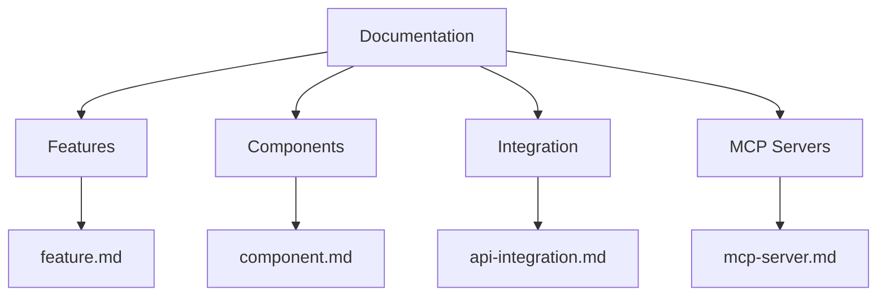

# Documentation Templates

## Overview
This directory contains standardized templates for various types of documentation. Using these templates ensures consistency and completeness across the project's documentation.

## Available Templates

### Core Documentation

### Template Descriptions

#### 1. Feature Documentation
- **File**: [feature.md](documentation/feature.md)
- **Purpose**: Document individual features and their implementations
- **Use When**: Adding new features or major feature updates
- **Key Sections**:
  - Overview
  - Requirements
  - Technical Design
  - Implementation Details
  - Testing Strategy

#### 2. Component Documentation
- **File**: [component.md](documentation/component.md)
- **Purpose**: Document reusable components and their interfaces
- **Use When**: Creating new components or updating existing ones
- **Key Sections**:
  - Interface
  - Dependencies
  - Usage Examples
  - Error Handling
  - Testing

#### 3. API Integration Documentation
- **File**: [api-integration.md](documentation/api-integration.md)
- **Purpose**: Document external service integrations
- **Use When**: Setting up new API connections
- **Key Sections**:
  - Authentication
  - Endpoints
  - Error Handling
  - Rate Limiting
  - Security

#### 4. MCP Server Documentation
- **File**: [mcp-server.md](documentation/mcp-server.md)
- **Purpose**: Document Model Context Protocol server implementations
- **Use When**: Creating or modifying MCP servers
- **Key Sections**:
  - Tools Provided
  - Resources Provided
  - Communication Protocol
  - Integration Guide

## Usage Guidelines

### 1. Template Selection
- Choose the appropriate template based on what you're documenting
- Use the most specific template available
- Combine templates if needed for complex documentation

### 2. Filling Templates
- Replace all placeholder text (e.g., [Component Name])
- Remove unused sections
- Add additional sections as needed
- Keep formatting consistent

### 3. Validation
- Ensure all required sections are completed
- Verify code examples are accurate
- Check links are working
- Validate Mermaid diagrams

### 4. Maintenance
- Update documentation when code changes
- Review periodically for accuracy
- Keep examples up to date
- Update templates as needs evolve

## Best Practices

### 1. Writing Style
- Be clear and concise
- Use consistent terminology
- Provide relevant examples
- Include context and purpose

### 2. Code Examples
- Use TypeScript for type clarity
- Include error handling
- Show common use cases
- Keep examples simple

### 3. Diagrams
- Use Mermaid for consistency
- Keep diagrams focused
- Include legends when needed
- Use consistent styling

### 4. Cross-Referencing
- Link to related documentation
- Reference dependent components
- Cite external resources
- Maintain link accuracy

## Template Updates

### Requesting Changes
1. Open an issue describing the needed change
2. Provide rationale for the update
3. Include example of the problem
4. Suggest specific improvements

### Making Changes
1. Create a new branch
2. Update template(s)
3. Test with sample content
4. Submit pull request

## Notes
- Templates are guidelines, not rigid rules
- Adapt as needed for specific cases
- Maintain consistency where possible
- Suggest improvements when needed
