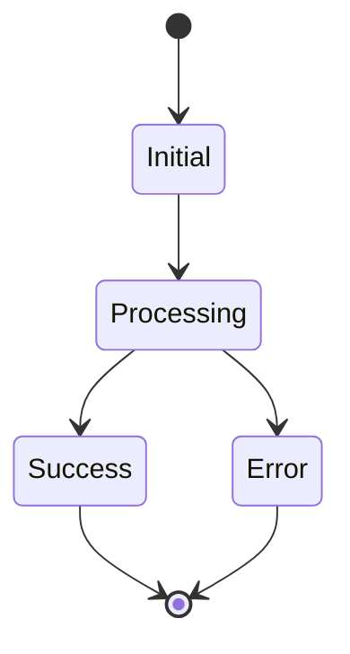

# Component: [Component Name]

## Purpose
Brief description of what this component does and why it exists.

## Interface
```typescript
interface ComponentInterface {
    // Core methods
    method1(param: Type): ReturnType;
    method2(param: Type): ReturnType;

    // Properties
    property1: Type;
    property2: Type;
}
```

## Dependencies
- Dependency 1
  - Purpose: Why it's needed
  - Version: x.y.z
  - Import: `import { Thing } from 'dependency'`

- Dependency 2
  - Purpose: Why it's needed
  - Version: x.y.z
  - Import: `import { Thing } from 'dependency'`

## Usage Example
```typescript
// Basic usage
const component = new Component();
await component.method1('param');

// Advanced usage
const result = await component.method2({
    option1: 'value',
    option2: true
});
```

## Error Handling
```typescript
try {
    await component.riskyOperation();
} catch (error) {
    if (error instanceof SpecificError) {
        // Handle specific error case
    } else {
        // Handle general error case
    }
}
```

## Events
| Event Name | Trigger | Payload | Purpose |
|------------|---------|---------|----------|
| event1 | Condition | `{ data: Type }` | Purpose |
| event2 | Condition | `{ data: Type }` | Purpose |

## State Management


## Performance Considerations
- Time complexity: O(n)
- Space complexity: O(1)
- Caching strategy
- Resource usage

## Testing
```typescript
describe('Component', () => {
    it('should handle basic operation', () => {
        // Test code
    });

    it('should handle error cases', () => {
        // Test code
    });
});
```

## Security Considerations
- Input validation
- Authentication requirements
- Authorization checks
- Data sanitization

## Configuration
```typescript
interface ComponentConfig {
    option1: string;
    option2: boolean;
    option3?: number;
}
```

## Lifecycle
1. Initialization
   - Steps
   - Requirements
   - Validation

2. Operation
   - Normal flow
   - Error conditions
   - Recovery

3. Cleanup
   - Resource release
   - State reset
   - Verification

## Related Components
- Component 1: Relationship description
- Component 2: Relationship description

## Known Issues
- Issue 1: Description and workaround
- Issue 2: Description and workaround

## Future Improvements
- [ ] Improvement 1
- [ ] Improvement 2
- [ ] Improvement 3

## Version History
| Version | Changes | Breaking Changes |
|---------|---------|-----------------|
| 1.0.0 | Initial release | N/A |
| 1.1.0 | Added feature X | None |

## Notes
Additional technical notes, gotchas, or special considerations.
