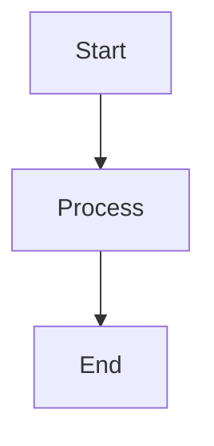

# Feature: [Feature Name]

## Overview
Brief description of the feature and its purpose.

## Requirements
- [ ] Requirement 1
- [ ] Requirement 2
- [ ] Requirement 3

## Technical Design

### Components
- Component 1
  - Purpose
  - Responsibilities
  - Dependencies

- Component 2
  - Purpose
  - Responsibilities
  - Dependencies

## Implementation Details

### Key Files
- `path/to/file1.ts` - Purpose
- `path/to/file2.ts` - Purpose

### Data Flow
1. Step 1
2. Step 2
3. Step 3

### Error Handling
| Error Scenario | Handling Strategy | Recovery Process |
|----------------|------------------|------------------|
| Scenario 1 | Strategy | Recovery |
| Scenario 2 | Strategy | Recovery |

## Testing Strategy

### Unit Tests
- [ ] Test case 1
- [ ] Test case 2
- [ ] Test case 3

### Integration Tests
- [ ] Test scenario 1
- [ ] Test scenario 2
- [ ] Test scenario 3

## Validation Checklist
- [ ] Requirements met
- [ ] Tests passing
- [ ] Documentation complete
- [ ] Error handling verified
- [ ] Performance acceptable

## Related Documents
- [Link to related doc 1]
- [Link to related doc 2]

## Status History
| Date | Status | Notes |
|------|--------|-------|
| YYYY-MM-DD | Status | Notes |

## Notes
Additional information, considerations, or special instructions.
